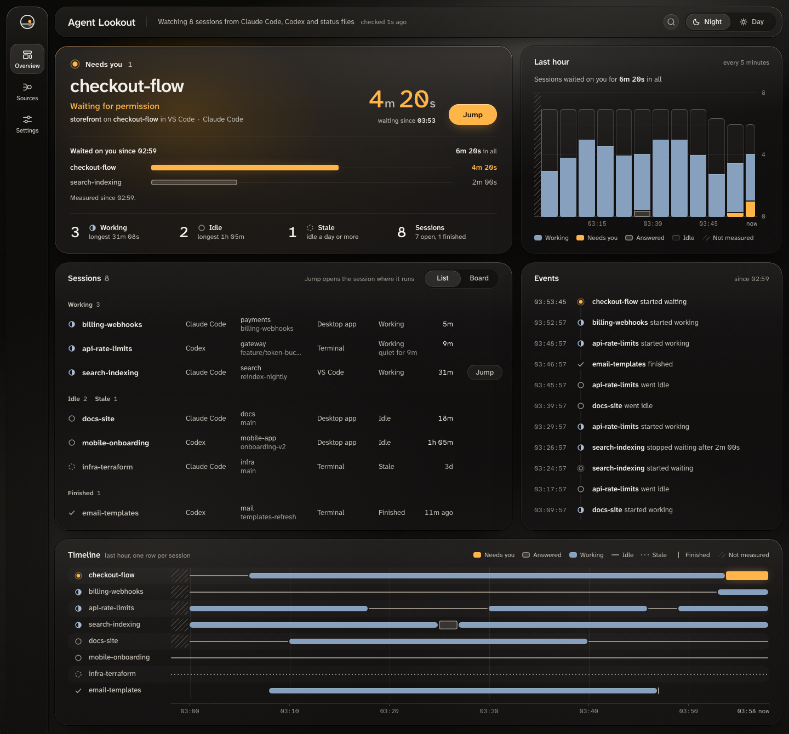

# Agent Lookout

Agent Lookout puts every Claude Code and Codex session running on your Mac on one page in your browser, and shows which Claude Code sessions are waiting for you.

<picture>
  <source media="(prefers-color-scheme: light)" srcset="docs/images/dashboard-day.png">
  
</picture>

The website is [agent-lookout.vercel.app](https://agent-lookout.vercel.app).

It reads the list of sessions Claude Code keeps on your computer, so it finds sessions in a terminal, in VS Code or in the Claude Code desktop app with no setup. For Codex it reads the session files Codex saves in `~/.codex`, also with no setup. It only watches. A Jump button can take you to a Claude Code session, by opening it in VS Code, by selecting the tmux pane it runs in, or by bringing its tab of Terminal or iTerm2 to the front. The first time you jump to a tab, macOS asks once whether the program Agent Lookout runs in may control that app. It still cannot start, stop or answer a session. Turn on notifications in Settings and you are told when a Claude Code session starts waiting: by your browser while the dashboard is open in a tab, and by Agent Lookout itself once the tab is closed, for as long as it keeps running. If you set it up, it can also email you, or post to a Slack channel through a webhook, when a session has waited a while.

Today it watches Claude Code and Codex on macOS. Codex does not record when it is waiting for your approval, so a Codex session shows as working, idle or finished, never as needing you. Codex support is new: it has been checked with the Codex desktop app, and not yet with the Codex CLI or its IDE extension. Any other agent, including one you wrote yourself, can appear by writing a small status file for each session, as the [guide](docs/GUIDE.md#your-own-agents) shows. Other coding agents, AI chat tabs in the browser and a Mac app are planned, in the [roadmap](https://github.com/Olanetsoft/agent-lookout/milestones).

## Install

1. Check that Node.js is installed, and Claude Code, Codex or both.

   ```sh
   node --version
   claude --version
   codex --version
   ```

   The first prints `v20.19.0` or newer (on Node 22, `v22.12.0` or newer). The second prints a version number followed by `(Claude Code)`, and the third `codex-cli` followed by a version number. You need Node.js and at least one of the other two. If a command you need is not found, install that program first. Agent Lookout never runs `codex`, so if you use only the Codex desktop app and `codex` is not found, carry on.

2. Download Agent Lookout and install what it needs.

   ```sh
   git clone https://github.com/Olanetsoft/agent-lookout.git
   cd agent-lookout
   npm install
   ```

   npm prints `added ... packages` and no line that starts with `npm error`.

3. Start it. It keeps running until you press Ctrl+C, so leave this terminal open or run it in the background.

   ```sh
   npm run dev
   ```

   It prints `Local:   http://localhost:5173/`. If 5173 is already in use it picks the next number and prints that instead. Use the number it printed in the next two steps.

4. From a second terminal, check that it answers.

   ```sh
   curl -s http://localhost:5173/api/health
   ```

   It prints `{"ok":true,"version":"0.1.0"}`, or a later version number.

5. Open <http://localhost:5173>. Your sessions appear within a few seconds.

To start it again later, run `npm run dev` in the `agent-lookout` folder. The [guide](docs/GUIDE.md) explains each part of the screen, the settings, and what to do when no sessions appear.

To see which sessions need you without opening the browser, run `npm run --silent status` in the same folder, or put it in a tmux status line or a shell prompt as the [guide](docs/GUIDE.md#in-the-terminal) shows.

## Privacy

By default Agent Lookout itself sends nothing anywhere. Email notifications and webhook posts are both off unless you set them up. Once you set up email, it sends a short email when a session has waited, and, if you choose, when one finishes, fails or ends, through the mail server you name, to the address you name, and nothing else. Once you set a webhook address, it sends the same notices as short posts to that one address and nowhere else: each holds the session's name, what happened, when, and the name of its folder, its app and its agent. The [guide](docs/GUIDE.md#email) says how to set up email, [Webhook](docs/GUIDE.md#webhook) how to set up a webhook for Slack, and both say how to turn them off. It does run Claude Code's own listing command, which may contact Anthropic the way Claude Code normally does. Codex's session files hold your conversations. Agent Lookout opens them only to read a few details, such as each session's folder and when each turn started and ended, and keeps none of your prompts, Codex's replies or the commands it ran. [PRIVACY.md](PRIVACY.md) lists everything it reads and runs, and what an email and a post hold.

## Contributing

[CONTRIBUTING.md](CONTRIBUTING.md) covers setup, the checks to run and how to add another agent.

Agent Lookout is [MIT licensed](LICENSE). It is an unofficial project, not affiliated with or endorsed by Anthropic, OpenAI or any other agent maker. See [DISCLAIMER.md](DISCLAIMER.md).
