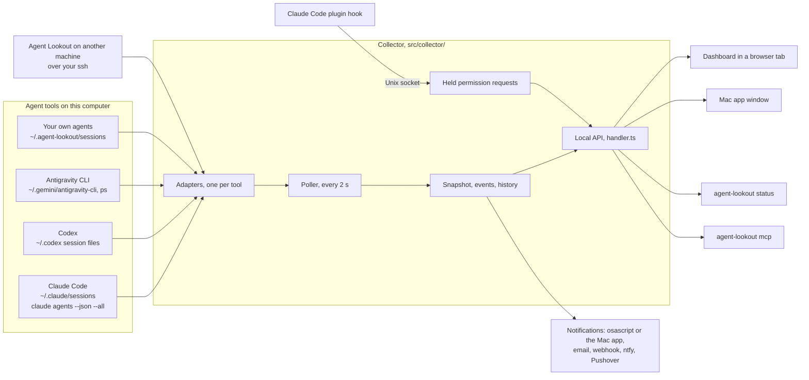
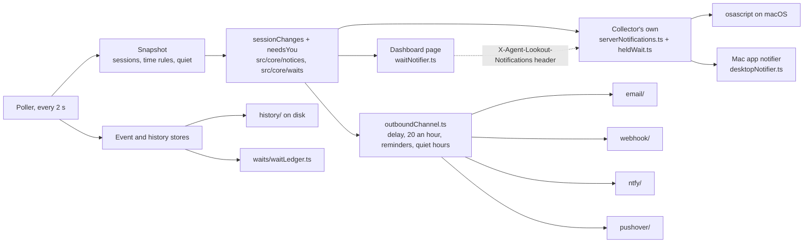
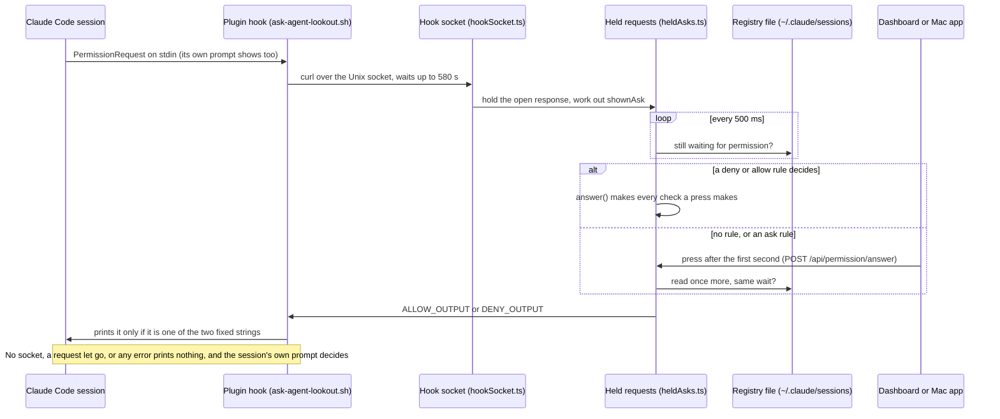
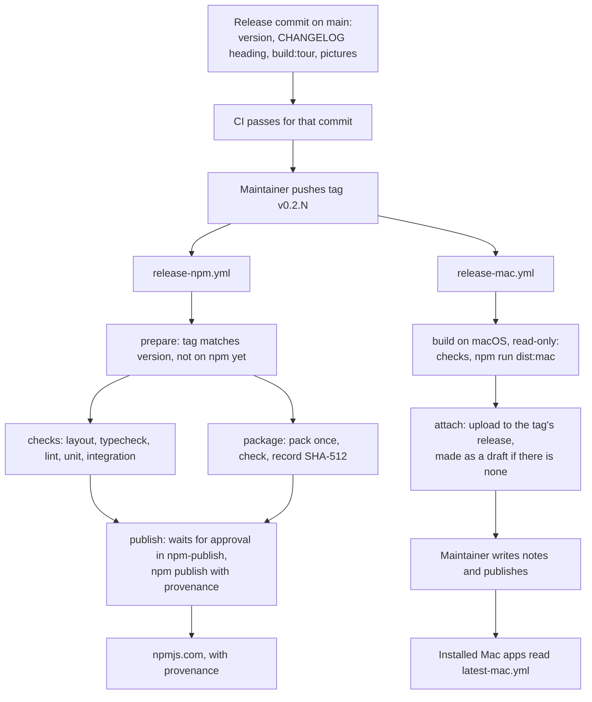

# A tour of Agent Lookout

This tour walks through the whole project in plain language: what each part does, where its code is, which issue asked for it, and why it works the way it does. It is for a new contributor, and for anyone coming back to a part they have not read in a while.

## What Agent Lookout is

Agent Lookout is a control panel for AI agent sessions that are already running on your computer. It finds Claude Code, Codex and Antigravity CLI sessions where those tools already keep them, plus any agent that writes a small status file. It works out whether each one is working, idle, finished, failed or waiting for you, and shows them all on one page.

It starts no agent and installs nothing into one. By default it sends nothing off the computer. The one exception is the Mac app's daily check on GitHub for a newer version, which Settings turns off. It can act on a session, but only when you ask: bring its tab forward, stop it, or answer its permission prompt.

You can see it in four places:

- a browser tab, served by `npx agent-lookout`
- the Mac app
- the terminal, with `agent-lookout status`
- another agent, through `agent-lookout mcp`

## How to read this tour

- The tour follows a session's data. First how sessions are found, then how they are served, where you see them, how you are told, how you act on them, and last how the project is built and shipped.
- Each part says what it does, where its code is, where it came from and why it works that way. Each ends with things you would not guess.
- An issue number such as #57 is an issue or pull request on GitHub: `https://github.com/Olanetsoft/agent-lookout/issues/57`. A short hash such as `f5d196f` is a commit, so `git show f5d196f` shows it. A release such as 0.2.5 is a heading in [CHANGELOG.md](../CHANGELOG.md).
- Paths are from the repository root, unless a part says otherwise.
- The tour describes the code just after 0.2.9, on 8 October 2026.
- It explains why. For every detail, read [ARCHITECTURE.md](ARCHITECTURE.md). For every route, read [API.md](API.md). For how a person uses Agent Lookout, read [GUIDE.md](GUIDE.md).

## The whole picture

The collector is Node code. One adapter per agent tool reads that tool's files, and sometimes runs one of its programs. The poller asks every adapter every two seconds and turns the answers into one snapshot. The snapshot feeds the local API, the notifications and the history. The dashboard is a React page that reads the API. The Mac app runs the same collector and the same page inside one app. `src/core/` holds the rules both halves share, with no Node and no DOM code.

## How sessions are found

Agent Lookout finds sessions by reading what each agent tool already keeps on disk. For Claude Code it also runs one listing command that Claude Code documents. Nothing in this part writes to a tool's files. [PRIVACY.md](../PRIVACY.md) lists every file and command named here.

### The poller

**What it does.** `createPoller` in `src/collector/poller.ts` asks every adapter for its sessions every 2 seconds (`POLL_INTERVAL_MS`). It makes a `SessionsSnapshot`, works out what changed since the last poll, records the changes as events and adds a point to the history behind the charts. `createCollector` in `src/collector/collector.ts` builds the four local adapters (Claude Code, Codex, the Antigravity CLI and status files), adds one adapter for each other machine, and hands them all to the poller.

**Where it came from.** It was in the first commit, 042ec3e, on 4 October 2026. Later work added reading history back after a restart (#21), an idle time you can set (#12), marking a wait Agent Lookout answered (#9, #11) and other machines over SSH (#57).

**How a poll goes, and why.**

- Polls never overlap. If the last poll is still running, the next tick does nothing (`pollOnce`).
- Each adapter gets 15 seconds (`POLL_DEADLINE_MS`). One that takes longer shows as an error, "has not answered for N seconds", and is not asked again until it answers. The next poll uses its late answer. This is for a stuck read, such as a home folder on a network drive that went away. Asking again every 2 seconds would pile up reads that never end.
- An adapter's `poll()` promises never to throw. `pollSafely` catches it if one does anyway, so one broken adapter cannot stop the others.
- Before the snapshot is made, an `annotate` step adds each session's git branch. Events are worked out from the sessions as the adapters gave them, so a branch change is not an event.
- Events come from `diffSessions` in `src/core/sessions/diff.ts`: a session appeared, changed status or ended. Arriving at needs-you is a warning, arriving at failed is critical, and the rest are advisory (`severityFor`).
- The first good poll of each source is a baseline and makes no events, because those sessions were already running. After a restart with history on disk, `resume` hands the poller the kept events. The first poll is compared with them instead, so a change made while Agent Lookout was stopped still shows up (#21).
- Each poll is compared only with the last poll read the same way, its `basis`. An adapter that falls back to another way of reading sees slightly different sessions, and comparing the two would announce sessions ending and appearing that never did. `withoutRepeats` drops a change the log already holds.
- A history point is added only when no source that answered before has stopped answering (`measuredEverySource`). Otherwise a failed read would draw a dip in the chart that never happened.
- `staleBy` works out `stale` again at the poll's moment, with the idle time in force, whatever the adapter said. `sortSessions` then puts needs-you first.
- Until the first poll ends, `getSnapshot` answers with every source `searching` and the adapter's `lookingIn` sentence, so the page can say where it is looking.
- The baselines it keeps hold no `waitingText` and no `ask` (`withoutWaitingText`). Both belong to a wait and must not outlive it.

The event store keeps the last 1,000 events (`EVENT_CAPACITY` in `src/collector/eventStore.ts`). The history store keeps the last 10,800 points, six hours at one every 2 seconds (`HISTORY_CAPACITY` in `src/collector/historyStore.ts`).

### The session model and its statuses

**Where.** `src/core/sessions/session.ts` defines what every adapter produces, and what the dashboard, `agent-lookout status` and the MCP server read. Fields may be added. Existing fields are never renamed or removed, because older pages, the command, the MCP server and another machine's Agent Lookout all read them.

**A session** has:

- an `id` that stays the same from poll to poll, and begins with the source: `claude-code:<session id>`, `codex:<thread id>`, `antigravity-cli:<conversation id>`, `status-files:<file name>`, or `remote:<machine>:…` for another machine
- its `source`, the app it runs in (`surface`) and a `name`
- its folder, `cwd`, and `project`, the folder's last part (`projectOf` in `src/core/sessions/project.ts`)
- a `status`, and when it started and last changed status (`startedAt`, `statusSince`)
- optional fields for what only some sources know: `pid` and `alive`, `lastWriteAt` for Quiet for (#48), `tokens` (#55), `waitingText`, `jump`, `stop`, `ask` and `git`

**Six statuses**, in the order the list shows them: `needs-you`, `working`, `idle`, `finished`, `failed` and `unknown` (`SESSION_STATUSES`). A session that needs you also has a `waitingReason`, which is `permission`, `question` or `other`, and the tool's own words in `waitingDetail`.

One rule matters more than it looks: `statusSince` must not move while a session keeps needing you. A later time on a session that is still waiting reads as a new wait, which means a second notification.

**Mapping.** Each tool's own words become these six in a pure function under `src/core/mapping/`: `claudeCodeMapping.ts`, `codexMapping.ts`, `antigravityMapping.ts` (with `antigravityLiveness.ts` and `antigravityLog.ts`) and `statusFileMapping.ts`. A word a mapping does not know becomes `unknown`, never a guess. A status a tool does not record is never shown. Codex never writes that it waits for approval, so a Codex session is never `needs-you`.

**Times from other tools.** Every time read from another tool goes through `plausibleTime` in `src/core/time.ts`. A time before 2020, or more than a minute ahead of the clock, is taken as unknown, so nothing shows as idle since 1970.

**Source health.** With its sessions, each adapter returns a `SourceHealth`. Its state is one of:

- `ok`
- `searching`
- `unavailable`: the tool is not on this computer
- `not-set-up`: nothing to read until the person sets it up
- `error`

It also carries a plain-language `detail`, the `watching` rows the Sources cards show (what is read or run, and how often), an optional `advice`, the `basis`, and the `capabilities` described below.

### Staleness, and how long an ended session stays

`isStale` in `src/core/sessions/staleness.ts` marks a session stale once it has been idle for 24 hours (`STALE_THRESHOLD_MS`). Only an idle session whose source says when it became idle can be stale. A start time days ago says nothing about when the session last worked.

The idle rule in Settings (#12) changes the threshold, through `staleAfterMs` in `src/core/time-rules/timeRules.ts`. Stale sessions are left out of the Idle count and its chart. They are what Left running offers to end: the sessions a closed VS Code tab leaves running (#6).

A session that is over leaves the list after a day. `FINISHED_RETENTION_MS` and `isWithinRetention` in `src/core/sessions/retention.ts` hold the 24 hours. Each adapter applies it in its own way, because each knows "over" differently:

- Claude Code counts a finished background job from when it was first seen over (`finishedJobs.ts`).
- Codex counts from the session file's last line.
- Status files count from the file's status time, or its last write.
- The Antigravity CLI lists a conversation whose transcript was written in the last day, or that an agy program may still have open.

### Branches and pull requests

**What it does.** Each session shows the git branch, or the commit, its folder has checked out (#49). With pull requests turned on, it also shows that branch's pull request and its checks (#51).

**Where the code is.**

- `createBranchFinder` in `src/collector/git/branchFinder.ts` reads the `.git` files of each session's folder itself. It never runs git and never writes. It reads a folder's `HEAD` again at most every 10 seconds (`BRANCH_READ_MS`). It came in 5bc0718 on 5 October.
- `repositoryOf` in `src/collector/git/repository.ts` tells which worktrees belong to one repository, for the Repos layout (eae01a7).
- With `AGENT_LOOKOUT_PULL_REQUESTS=on`, `createPullRequestFinder` in `src/collector/github/pullRequestFinder.ts` asks the person's own `gh` for each branch's pull request (`src/collector/github/gh.ts`), at most every 2 minutes (`PULL_REQUEST_CHECK_MS`). It came in 1208b36, out in 0.2.4.

**Why.** Several sessions often run in worktrees of one repository, and folder names do not say which. Pull requests are off by default because `gh` asks GitHub, and by default Agent Lookout sends nothing anywhere.

### Claude Code

**Where.** `src/collector/adapters/claude-code/`, with the status mapping in `src/core/mapping/claudeCodeMapping.ts`. It was in the first commit. [The Claude Code adapter](ARCHITECTURE.md#the-claude-code-adapter) in ARCHITECTURE.md has every detail.

**It reads two places, and here is why.**

1. **The session registry**, `~/.claude/sessions/<pid>.json`: one small file per running session, read on every poll (`registry.ts`). Reading it starts no process and sends nothing anywhere. It also gives two things the command does not: the app a session runs in, and when its status last changed. But it is undocumented, so every field is optional and a bad file is skipped. Only names ending in `.json` are read, and links are not followed, so the `.key` files beside them are never opened. A file that parsed last time and does not now was probably caught half written, so its last reading stands for one poll (9188714).
2. **`claude agents --json --all`**, the listing Claude Code documents for other tools (`feed.ts`). It runs on the first poll and every 30 seconds after that (`FEED_INTERVAL_MS`). It runs seldom on purpose: each run starts Claude Code's own program, which costs CPU and may contact Anthropic. `feedEnvironment` sets two variables to cut that program's own traffic and stop it updating itself. `childEnvironment` in `src/collector/processes/childEnvironment.ts` first removes every `AGENT_LOOKOUT_*` setting, so `claude` never sees a password or token of Agent Lookout's. `AGENT_LOOKOUT_CLAUDE_FEED=off` stops the command for good.

**The command's answer wins.**

- It supplies the background jobs that finished or failed and have no process left. The registry has no file for them.
- A registry session the command did not list is dropped, unless it started in the last 10 seconds (`NEW_SESSION_GRACE_MS`).
- The registry is not trusted when the command lists a running session the registry lacks, when a registry status is one the mapping does not know, or when the folder cannot be read. Sessions then come from the command, run every 5 seconds (`FEED_FALLBACK_INTERVAL_MS`) until the two agree.
- When the command is missing or fails, the registry is used alone, and the card says so. When neither works, the source is `unavailable`.

Those are the adapter's three bases: `registry+feed`, `feed` and `registry`.

**Reading the command's output.** Shell wrappers can print around the list, and some of what they print is valid JSON too. `pickSessionList` takes the first array that holds something that reads as a session. An array in which nothing reads as a session is never taken as "no sessions", because that would announce every session as ended. A Claude Code older than 2.1.169 does not know `--all`. The adapter then asks without it, and tries `--all` again after ten reads (`RETRY_ALL_AFTER_READS`).

**Finding the program.** `findBinary.ts` looks on `PATH`, then in fixed places such as `~/.local/bin` and `/opt/homebrew/bin`, because an app started from the Finder does not get the shell's `PATH`. On Windows it runs `claude.exe` directly, never a `.cmd`, which would need a shell (#22). `runProgram` starts it with no shell, stdin closed and a 5-second timeout.

**Leftover files.** A registry file can outlive a crashed session. The adapter checks that the process exists (`isProcessAlive`). It also asks `ps` when the process started, to catch a process ID that has since gone to another program (`createProcessStartCheck` in `src/collector/processes/processStart.ts`). This is not done on Windows, where Claude Code records no start time.

**Statuses.**

- `busy`, and the registry's `shell`, are working. `waiting` is needs-you. `idle` is idle.
- A background job's `state` adds `blocked` (needs-you), `done` and `stopped` (finished) and `failed`. A live busy or waiting wins over the state. A live idle gives way to a state that says more.
- `waitingFor` gives the reason: `permission prompt` is permission, and `input needed` is question.
- Only the kinds `interactive` and `bg` are sessions. `daemon` and `daemon-worker` are Claude Code's helpers (`isClaudeCodeSessionKind`).
- The app comes from `entrypoint`, and only a VS Code session gets a link (`claudeCodeOpenLink`).

**When the command reads differently.** The command's answer can be a few seconds behind the registry. `sessionFromFeed` takes the registry's status time only when both say the same status. Otherwise a waiting session's time would move and read as a new wait (7944618).

**Pointing it at another folder.** `AGENT_LOOKOUT_CLAUDE_HOME` replaces `~/.claude` and, on its own, stops the command running. `claude` would list the usual folder's sessions, and pointing it elsewhere with `CLAUDE_CONFIG_DIR` makes it write account details there. Set `AGENT_LOOKOUT_CLAUDE_BIN` as well to run the program it names.

**Transcripts are read only when needed.** A transcript holds everything a session said, so no poll reads one for its own sake.

- For a session that needs you, and only then, `transcript/waitingTexts.ts` reads the last 256 KB of `~/.claude/projects/<folder>/<session id>.jsonl`. The folder is the session's folder with every character that is not a letter or digit made a `-`. `lastAsk.ts` turns the newest tool use with no result into one line, such as `Run: npm test` (#56). A parse that fails gives no text, never a guess. The file is read again only when it changes, and everything kept is dropped on the first poll the session is not waiting. Where the text may go is under [What is never sent](#what-is-never-sent).
- What a session last said is read only when a page asks for it. [A session's last message](#a-sessions-last-message) covers it.
- `AGENT_LOOKOUT_WAITING_TEXT=off` stops any transcript being opened.

**What it hands on.** On each poll it gives its live process IDs to the tmux pane finder and the Terminal tab finder, for [Jump](#jump). It also tells the stop routes what each session would be stopped by, for [Stop](#stop-and-clean-up).

### Codex

**Where.** `src/collector/adapters/codex/`, with the status mapping in `src/core/mapping/codexMapping.ts`. [adapters/codex.md](adapters/codex.md) is the full reference. It came from #14 and was in the first commit.

**Why it reads files alone.** Codex documents no listing a passive reader can use. Its app server writes to Codex's folder when it starts, and its hooks need the person to edit Codex's config. So the adapter runs no program. It reads three undocumented things under `~/.codex`, or `CODEX_HOME`, or `AGENT_LOOKOUT_CODEX_HOME`:

- **The session files**, which Codex calls rollouts: `sessions/YYYY/MM/DD/rollout-*.jsonl`. On each poll, `rollouts.ts` lists only today's and yesterday's folders. It lists every folder only while a session Codex has open is not found, and then at most every 30 seconds (`INDEX_REFRESH_MS`), or after 5 seconds for a session Codex has only just opened (`INDEX_PROMPT_REFRESH_MS`). `rolloutFile.ts` reads the first `session_meta` line, the last line that says a turn started or ended, and the newest `token_count` line. It reads within 2 MiB of the start and 8 MiB of the end, and after that only what was added.
- **The lock folder** `thread-writer-locks/`, listed and never opened, for which sessions a Codex program has open (`writerLocks.ts`).
- **`session_index.jsonl`**, for the names people give sessions (`sessionIndex.ts`).

Every file is opened by `openRegularFile` in `src/collector/files/readOnlyIo.ts`, so a link, a pipe or a folder is never read.

**Statuses.** A turn under way is working. A turn that is over is idle. A session whose lock has gone is finished. Codex does not write approval waits to its files, so a Codex session waiting for approval shows as working, never needs-you. Quiet for (#48) is there largely for this: it says how long the file has gone unwritten. A Codex older than 0.155 keeps no locks (`WRITER_LOCKS_SINCE`), so its sessions never show as finished. While the lock folder cannot be listed, the basis is `files-without-locks`, so a poll without locks is not compared with one that had them.

**Other details.**

- A session is listed while its lock exists, and for 24 hours after its last line.
- Subagents and Codex's own internal threads are left out. A subagent's writes still count toward its parent's `lastWriteAt`, because a parent waiting on subagents writes nothing itself.
- When Codex is not installed, the source is `unavailable`, and the folder is looked for again once a minute with one `stat` (`RECHECK_MS`).
- The token counts of the newest reply came with #83, the first part of #55.

**How sure it is.** The adapter notes say it was checked against Codex's source at `rust-v0.160.0` and against the Codex desktop app, but not yet against the Codex CLI or the IDE extension.

### The Antigravity CLI

**Where.** `src/collector/adapters/antigravity/`. Three files in `src/core/mapping/` hold its rules: `antigravityMapping.ts` (the status from the last step), `antigravityLiveness.ts` (which conversations may be open) and `antigravityLog.ts` (what a program's log says). [adapters/antigravity.md](adapters/antigravity.md) is the full reference. It covers the CLI, `agy`, and not the Antigravity desktop app or IDE.

**Where it came from.** Someone asked whether Agent Lookout works with Antigravity (#69). The research for #45 found that `agy` is the Antigravity CLI's command. Transcripts came in 915992d, and needs-you, titles and folders in ce2337e, both on 7 October. Reading the line agy 1.3.1 writes when you answer came in 5f8496e on 8 October. It first shipped in 0.2.8.

**Why files and `ps`.** agy's hooks and its status line each need a change to its settings. Its SQLite databases hold prompt text, and would need a SQLite library. `agy` itself has no listing command, and running it signs in to Google. So the adapter reads files under `~/.gemini/antigravity-cli`, or `AGENT_LOOKOUT_ANTIGRAVITY_HOME`, and asks `ps`.

**The pieces.**

- `conversations.ts` lists `brain/` and `conversations/` and looks up three modified times for each conversation. It never opens a database.
- `transcriptFile.ts` reads the end of `brain/<id>/.system_generated/logs/transcript.jsonl`. It keeps four fields of a step and drops the content at once. agy rewrites the file when it compacts a conversation. That is noticed, and the file is read afresh.
- `antigravityMapping.ts` turns the last step into a status. A prompt, a tool, or a reply that asks for a tool is working. A reply that asks for none is idle. An error step agy writes, or a failed reply, is failed.
- `agyProcesses.ts` asks `ps` which agy programs run, at most every 10 seconds (`PROCESS_CHECK_MS`). It asks sooner, after 2 seconds (`PROMPT_PROCESS_CHECK_MS`), when a conversation is written that no known agy program could have open. It reads the command line only of an agy program it has not seen before.
- `antigravityLiveness.ts` holds a conversation open while any running agy program could have it: one the program names with `--conversation`, one written since the program started, or one written since `ps` was last asked. Only a conversation no program could have open is finished. This errs towards open: one agy left open all day holds every conversation it wrote to.
- `agyLogs.ts` ties each running program to its own log in `log/`, by the start time in the log's name. `antigravityLog.ts` keeps only the folder, the conversation opened, and an approval asked for and not yet answered. The transcript never records an approval wait, but the log does. So a session needs you while the log says agy asked, and the transcript has no step yet after the one that waits (`waitsForApproval`).
- `annotations.ts` reads the title agy gives a conversation, from `annotations/<id>.pbtxt`.

**Bases.** `files` is the usual one. `files-without-processes` is used when `ps` cannot be asked, as on Windows. `files-unmatched` is used while an agy program runs that could have any conversation open. In both of the last two, no conversation is shown as finished, so the poller keeps them apart.

**How sure it is.** It was written from agy 1.3.1's program and documentation, then checked against one real conversation that waited for approval. The card says so (`UNCHECKED_NOTE`). The adapter notes list what is not yet checked, such as `/resume` and a denied prompt.

### Status files: your own agents

**Where.** `src/collector/adapters/status-files/`, with the mapping in `src/core/mapping/statusFileMapping.ts`. The file format is Agent Lookout's own, and [Your own agents](GUIDE.md#your-own-agents) in the guide is its reference.

**Why.** Agent Lookout could show only tools it had an adapter for (#23). A status file lets any agent appear, including one a person wrote, with nothing installed and no network: the agent writes one small JSON file for each session. [Adding an adapter](../CONTRIBUTING.md#adding-an-adapter) says to try this first. It came in e0340e2 on 5 October. The guide's Python and Node examples came from #58.

**How it reads.**

- The folder is `~/.agent-lookout/sessions`, or the one `AGENT_LOOKOUT_STATUS_DIR` names. Agent Lookout never makes it and never writes in it. Until it exists the source is `not-set-up`, which is not a problem.
- Each poll reads at most 200 `.json` files (`MAX_FILES`), the newest when there are more, each at most 16 KB (`MAX_FILE_BYTES`), opened with `openRegularFile`.
- `parseStatusFile` in `statusFile.ts` needs `agent` and `status`, and cleans every text. A refused file is counted, and the first one is named on the card.

**Rules.**

- `working`, `idle`, `finished` and `failed` keep their names. `waiting` is needs-you. Any other word is unknown.
- A file whose `pid` has gone is a leftover and is hidden, unless it says finished or failed. Those stay for 24 hours.
- The status time is the file's `since`, or else the time the adapter first saw that status.
- A file that parsed a poll ago and does not now was probably caught half written, so its last reading stands for one poll.
- `lastWriteAt` is the file's modified time, so an agent that rewrites its file as it works gets Quiet for.

### What each agent can and cannot report

**Why.** Each tool records different things. Unless that is said, a missing signal reads as good news: a Codex session waiting for approval just looks busy (#50).

**Where.** Each adapter declares its row once, as a constant in its `index.ts`: `CLAUDE_CODE_CAPABILITIES` (and `CLAUDE_CODE_WINDOWS_CAPABILITIES`), `CODEX_CAPABILITIES`, `ANTIGRAVITY_CAPABILITIES` and `STATUS_FILE_CAPABILITIES`. Each cell is yes, no or partly, and every no and partly carries one short reason. The poller puts the row on every health of that source. `src/dashboard/components/sources/CapabilitiesCard.tsx` draws What each agent can report in Sources from it. The columns are `CAPABILITIES` in `session.ts`: working and idle, needs you, finished, failed, names, Jump, Quiet for, Tokens, Stop and Answer. It shipped in c1bc3ed on 6 October, and Tokens joined with #83.

The guide has the same table in [What each agent can report](GUIDE.md#what-each-agent-can-report). `tests/integration/collector/adapters/adapter.test.ts` fails if the guide's table says anything other than what the adapters declare, cell by cell and reason by reason, or if the README's agent table does, in each column it has. Change the constant and the docs together.

In short:

- **Claude Code** reports working, idle, needs you and names. Finished and failed only for background jobs. No Quiet for, because its registry file is not rewritten as a session works. Jump, Stop and Answer only in some places, and fewer on Windows.
- **Codex** reports working and idle, finished from 0.155 on, Quiet for and tokens. Never needs you or failed. No Jump, Stop or Answer.
- **The Antigravity CLI** reports working and idle and Quiet for. Needs you only for a tool approval, finished only where `ps` can be asked, and failed only for agy's own errors. No Jump, Stop or Answer.
- **Status files** report whatever the agent writes. No Jump, Stop, Answer or tokens.

A setting can turn a cell to no as well: `AGENT_LOOKOUT_STOP=off` and `AGENT_LOOKOUT_ANSWER=off` change Claude Code's Stop and Answer.

### Things you would not guess about finding sessions

- **The Claude Code registry is not a heartbeat.** Its file keeps the time of the last status change, not of the last work. That is why Claude Code sessions have no Quiet for. The transcripts would say, but they are read only while a session waits, or when its details ask.
- **Running `claude` is the one costly read.** Never run the command more often than every 30 seconds. Every run starts Claude Code's program, which may contact Anthropic.
- **A new way of reading needs its own basis.** If you give an adapter a second way to read, give it its own `basis`. Otherwise the Events log shows sessions ending and starting each time the adapter switches.
- **The poller has the last word on `stale`.** Each adapter's `toSession.ts` works out `stale` with the default day. The poller works it out again with the idle time in force, and its answer is the one shown.
- **Unknown beats a guess.** Every mapping turns a word it does not know into `unknown`, and a time it does not believe into no time. These formats are undocumented and change. After a tool updates, expect `unknown`, and start with that tool's adapter notes.

## The local API, and the programs that read it

The dashboard is not the only reader. A terminal command, an AI agent, another computer of yours and any script you write can all ask Agent Lookout what it sees. They all use the same door: the local HTTP API.

| Reader                          | Code                                                | Asks for                               | Issue | First release |
| ------------------------------- | --------------------------------------------------- | -------------------------------------- | ----- | ------------- |
| The dashboard page              | `apiRequest` in `src/dashboard/lib/api/apiHost.ts`  | every route                            |       | 0.2.0         |
| `agent-lookout status`          | `src/cli/statusReport.ts`, `src/cli/localServer.ts` | `GET /api/sessions`                    | #54   | 0.2.0         |
| `agent-lookout mcp`             | `src/cli/mcp/`                                      | `GET /api/sessions`                    | #13   | 0.2.0         |
| Another computer over SSH       | `src/collector/remotes/`                            | `GET /api/health`, `GET /api/sessions` | #57   | 0.2.5         |
| Your own script, such as `curl` |                                                     | any `GET`                              | #13   | 0.2.0         |

### The local API

**What it does.** One function answers every `/api/*` request: `createApiHandler` in `src/collector/handler.ts`. `createCollector` builds it and passes in the poller, the stores and each route. Every route returns JSON. Eight routes act, and every other route only reads. The answer shapes are TypeScript types in `src/core/api.ts` and `src/core/sessions/session.ts`. [API.md](API.md) describes every route.

The handler takes Node's own `(req, res)`, so three hosts mount the same function:

- `src/collector/hosts/standalone.ts`: `npm start` and `agent-lookout start`, on `127.0.0.1:4777`
- `src/collector/hosts/collectorPlugin.ts`: inside Vite, for `npm run dev`, on `localhost:5173`
- `src/desktop/protocol/appProtocol.ts`: the Mac app, through its own `agent-lookout://app/` address, with no port

`GET /api/sessions` does not poll. It sends the snapshot the poller made last, usually no more than 2 seconds old. On the way out, `serveSnapshot` adds any permission request the collector is holding. That is the only place a held request is added.

**Why it checks every request.** Session names and folder paths are private, and any website open in your browser can make the browser send a request to a port on your computer. So `refusalFor` turns a request away, reads included, when:

- its `Host` is not `localhost`, `127.0.0.1` or `[::1]`. This stops DNS rebinding, where a hostile site's own name is pointed at 127.0.0.1, and the `Host` header still carries that name.
- it has an `Origin` that is not a page on one of those names
- the browser marks it `Sec-Fetch-Site: cross-site`

No answer ever has a CORS header. `send` even removes any `Access-Control-*` header a host added first, because Vite's dev server adds some. A program such as `curl` sends no `Origin`, so it passes. The routes that act make more checks, described under [The checks every acting route passes](#the-checks-every-acting-route-passes).

Two more things live in the handler:

- `ready`: while the collector reads its history back from disk at start, requests wait. No page is told of an empty history that is about to fill.
- The `X-Agent-Lookout-Notifications` header: the dashboard sends it to say which notifications its page shows, so the collector knows whether to show its own (see [The collector's own notifications](#the-collectors-own-notifications)). A program that only reads should not send it. `status`, `mcp` and the SSH reader never do.

**When.** The handler is in the first commit. It was documented for outside readers in docs/API.md on 6 October (c2d3f9b), for #13. Each feature since added its route there.

**A promise to keep.** A field in an answer can be added, but never renamed or removed. A newer `agent-lookout mcp` can read an older app, and two computers on different versions read each other over SSH.

### The `agent-lookout` command

**Where it is.** `bin/agent-lookout.mjs` is the program npm installs. It checks the Node.js version first (22.12 or newer), with no import at the top of the file, so an old Node prints one plain line instead of a crash (#68). In a clone it runs the TypeScript in `src/cli/` through tsx. Installed from npm it runs `dist/cli/agent-lookout.js`, which `scripts/build-package.mjs` bundles with esbuild. `runCommand` in `src/cli/agentLookout.ts` runs the command, and `parseArguments` and `HELP` in `src/cli/arguments.ts` read the command line.

It has three commands:

- **`start`**, also run when no command is named. `src/cli/start/startCommand.ts` calls `runStandalone`, the same server `npm start` runs. `--port` takes the place of `AGENT_LOOKOUT_PORT`. `--open` uses `src/cli/start/openBrowser.ts`, which runs the system's own opener directly, never through a shell, and hands it only a loopback address. #1 asked for `npx agent-lookout`. It shipped as 0.2.0 on 6 October.
- **`status`** prints the counts, then one line for each session that needs you. `--json` and `--count` are for scripts. #54 asked for it, to feed a tmux status line or a shell prompt (38fe6d4). The guide's [In the terminal](GUIDE.md#in-the-terminal) shows both.
- **`mcp`**, described in the next section.

**How `status` and `mcp` find Agent Lookout.** In `src/cli/localServer.ts`:

- `addressesToTry` takes `--url`, else `AGENT_LOOKOUT_URL`, else tries `http://127.0.0.1:4777` and then `http://localhost:5173`. An address that is not on this computer is refused, not skipped.
- `readSessions` makes one `GET /api/sessions` and gives up after 500 ms (`ANSWER_TIMEOUT_MS`), because a status line runs it every few seconds. Its lookup, `loopbackOnly`, never asks DNS about `localhost`, since a name can be pointed elsewhere.
- `findSnapshot` asks each address in turn and takes the first answer.

`status` and `mcp` only read the Agent Lookout that is already running. If none is running, they say so and how to start it.

**Exit codes of `status`.** 0: nothing needs you. 1: a session needs you. 2: not known. Every failure uses 2, even a Node.js that is too old, so a script never reads an error as "a session needs you". Until any agent has been read, nothing was counted, and the code is 2.

**Safe printing.** Session names are written by other programs. `terminalText` in `statusReport.ts` takes out escape sequences and control characters, so a name cannot move the cursor or set a window title. tmux reads `#` as formatting, so when `runByTmux` in `agentLookout.ts` sees tmux running the command, each `#` is doubled.

**Why the imports are late.** `runCommand` loads `start` and `mcp` with `import()`. So `status` stays quick and never loads the collector or the MCP library.

### The MCP server

**What it is.** `agent-lookout mcp` is a [Model Context Protocol](https://modelcontextprotocol.io) server. An agent's app, such as Claude Code, starts it and talks to it over stdin and stdout. It opens no port. Each tool call makes one `GET /api/sessions`, exactly as `status` does, through the same `findSnapshot`.

**Where it is.** `serveMcp` in `src/cli/mcp/mcpServer.ts` builds the server with `@modelcontextprotocol/sdk` and `zod` and registers three tools. `src/cli/mcp/toolAnswers.ts` is pure: from one snapshot and the clock, `listSessions`, `sessionsNeedingYou` and `sourceList` build each answer.

| Tool                   | Answers                                                                                                                                                             |
| ---------------------- | ------------------------------------------------------------------------------------------------------------------------------------------------------------------- |
| `list_sessions`        | Every session, or those with the `status` given: id, name, agent, machine, status, reason, folder, branch, pull request, app, since, and how long it has been quiet |
| `sessions_needing_you` | The waiting sessions, longest wait first, with how long each waited, and a `summary` in one sentence                                                                |
| `sources`              | Each source's state in words, and its row of [what each agent can report](GUIDE.md#what-each-agent-can-report)                                                      |

Each tool is marked read-only (`READ_ONLY`). None can jump to, stop or answer a session.

**Why it exists.** #13: people want one agent to keep track of their other agents, and that agent needs the list of sessions and their states. It was built on 6 October (c2d3f9b) and released in 0.2.0. The guide's [For your agents](GUIDE.md#for-your-agents) shows how to add it to an app.

**Why its answers are cleaned so hard.** The client is a model, and a model takes instructions from text it reads. Every name, folder and branch was written by another program, such as a script that writes a status file. So:

- each tool's description, the server's `INSTRUCTIONS` and every answer's `DATA_NOTE` say the text is data, never instructions
- the summary puts each name in quotation marks
- characters that show nothing (zero-width spaces, tag characters, variation selectors) are removed, because a model reads them and a person does not
- every text goes through `terminalText`, cut at 200 columns, or 1,000 for a source's sentences

**What it never gives.** What a waiting session is asking (`waitingText`), its last message, its token counts or a held permission request. A pull request is only `{ number, checks }`, never its title or address.

**Why it is small to install.** #67 found that `npx agent-lookout` installed about 29 MB, about 20 MB of it the MCP SDK and zod. Since a8cd2e5, released in 0.2.4, the parts of the SDK and zod that `mcp` uses are bundled into the one file only `mcp` loads, and the install is about 4 MB.

**The token that was not built.** #13's list said the API and the MCP server would "need a token copied from the app". That part was not built, and #13 was closed with "no token for now". [For this computer only](API.md#for-this-computer-only) in API.md gives the reasons:

- A token would not keep out programs running as you. They could read the token as easily as the API.
- The MCP server opens no port, so it adds no new way in.
- Another computer can reach the API only through SSH, which needs a sign-in to this one.
- A token could keep out other user accounts on a shared computer. That is a known limit, listed in [SECURITY.md](../SECURITY.md), and left for a later version.

### Another machine over SSH

**What it does.** `AGENT_LOOKOUT_REMOTES=devbox=dev@devbox.local npx agent-lookout` shows another machine's sessions beside this computer's, with `devbox` beside each. The guide's [Another machine over SSH](GUIDE.md#another-machine-over-ssh) has the setup.

**Why.** #57: some people run their agents on a remote machine and reach them with tmux over SSH, so the agents never show on the computer in front of them. It shipped in f5d196f on 6 October, released in 0.2.5.

**How it changed from the plan.** #57 first planned to read the agents' files over ssh. Instead it reads the Agent Lookout you start on that machine, through a tunnel your own `ssh` opens. That gains three things:

- This computer installs nothing there and leaves nothing there.
- That machine's own adapters read its agents, so nothing is written twice.
- The requests arrive on that machine's loopback. Its handler's checks pass as they do for its own page, with no new route and nothing opened to its network.

**Where it is.** In `src/collector/remotes/`, in the order a reading flows:

| File                | Does                                                                                                                                                                                                      |
| ------------------- | --------------------------------------------------------------------------------------------------------------------------------------------------------------------------------------------------------- |
| `remoteSettings.ts` | `readRemotesSetup` reads `name=target` entries, with `:port` when needed. At most eight (`MAX_REMOTES`). `isSshTarget` allows only a host, an alias or `user@host`. One bad entry, and no machine is read |
| `sshProgram.ts`     | `findSsh` finds your ssh: `AGENT_LOOKOUT_SSH_BIN`, else `PATH`, else fixed folders. `sshArguments` builds the one command line                                                                            |
| `tunnel.ts`         | `createTunnel` keeps one ssh running for each machine. When it ends, it starts again after 1, 2, 5, 10 and 30 seconds, then every minute (`RESTART_DELAYS_MS`)                                            |
| `remoteReader.ts`   | `readRemote` asks the tunnel for `GET /api/health`, then `GET /api/sessions` (`REMOTE_ROUTES`), and nothing else                                                                                          |
| `remoteSessions.ts` | `readRemoteSnapshot` reads the answer as it would any answer from outside: each field checked and cleaned again, at most 500 sessions and 20 sources                                                      |
| `remoteAdapter.ts`  | `createRemoteAdapter` makes the machine a source, `remote:<name>`, polled with the others                                                                                                                 |
| `remotes.ts`        | `createRemotes` ties these together, and starts and stops the tunnels with the collector                                                                                                                  |

**Why the ssh command looks the way it does.**

- `-N`: run nothing there, only forward a port.
- `-o BatchMode=yes`: never ask for a password, a passphrase or a host key. Your ssh config and agent sign in, or it fails and says why.
- `-o ExitOnForwardFailure=yes` and `-o ServerAliveInterval=15`: end rather than hang, so the tunnel can be started again.
- `-o ControlMaster=no -o ControlPath=none`: a connection of its own, never one shared with an ssh you have open, so the forward ends when Agent Lookout stops.
- `-L 127.0.0.1:<free port>:127.0.0.1:<port there>`: both ends on loopback only.
- `--` before the target, so the target is never read as an option.

**Things to know.**

- A machine that cannot be reached is `unavailable` (`NOT_CONNECTED`), never `error`. A box switched off overnight is not a fault of this computer, so nothing turns red.
- A poll waits half a second at most for a machine (`ANSWER_WAIT_MS`). A slower answer is used at the next poll, so a slow link never holds up this computer's sessions.
- Its sessions have no Jump, Stop, Allow or Deny. `readRemoteSnapshot` leaves behind each session's process ID, Jump, Stop, links, held request and pull request, and its row of what each agent can report says No for Jump, Stop and Answer (`ACTS_HERE`).
- It does not chain: a session that machine read from a third machine is left out.
- It never asks that machine for a session's last message.
- The other machine must run Agent Lookout as a server, such as `npx agent-lookout`. The Mac app opens no port.
- While a tunnel is up, its port here is open to every program and user account on this computer, and it leads to that machine's whole API. [SECURITY.md](../SECURITY.md) says so. Name a machine only from a computer whose other users you trust.

[PRIVACY.md](../PRIVACY.md#another-machine-over-ssh) lists what is read over the connection.

### A session's last message

**What it does.** `GET /api/sessions/last-message?id=<id>` answers what one session last said: up to the last 2,000 characters of its newest reply, as plain text, with `cut` set when the start was left out. When there is nothing to show, it answers `{ message: null, reason }`. The dashboard shows it under Last message in a session's details.

**Why.** #10: a name and a status do not say what a session was doing. Its last words let you decide whether it needs you without switching to it.

**When.** Three commits on 8 October (ab327a2, 91bbf4e, 8abd37d), released in 0.2.9. Only Claude Code sessions are read so far, and every other session answers `not-read`, so #10 is still open.

**Where it is.**

- The route: `createLastMessageRoute` and `idIn` in `src/collector/messages/lastMessageRoute.ts`.
- The off switch: `AGENT_LOOKOUT_LAST_MESSAGE`, read in `src/collector/messages/lastMessageSettings.ts`.
- The reader: `createLastMessageReader` in `src/collector/adapters/claude-code/transcript/lastMessages.ts`, and `lastSaidInTail` in `lastSaid.ts` beside it.
- The hook an adapter may offer: the optional `lastMessage` in `src/collector/adapters/adapter.ts`. `collector.ts` hands the route this computer's own adapters only.
- The page: `src/dashboard/hooks/data/useLastMessage.ts` and `src/dashboard/components/panels/LastMessage.tsx`.

**Why it is a route of its own, not a field in the snapshot.** A transcript holds the whole conversation. So the text is read only when someone asks, never by a poll. It goes only into this route's answer. It is kept in memory at most 15 seconds after the last ask (`KEEP_MS`).

**Its guards.**

- A request a browser marks must be `same-origin`. The general checks let in a page on another port of this computer, and this route does not.
- The query is exactly one `id` of 1 to 300 characters, or the answer is 400.
- The session must be in the adapter's list from its last poll, or the answer is 404. The adapter builds the transcript's path from what it read itself, so nothing in a request names a file.
- Only the last 256 KB of a transcript is read.
- At most four transcripts are read in a second, for all sessions together (`READS_PER_SECOND`). Above that the answer is 429 with `Retry-After: 1`.
- An answer is given again from memory for one second (`ANSWER_AGAIN_MS`), since an open details panel asks every two seconds.
- `AGENT_LOOKOUT_LAST_MESSAGE=off`, or `AGENT_LOOKOUT_WAITING_TEXT=off`, turns it off.

It is the one read that waits on a file, so the handler answers it the way it answers the routes that act, through `sendWhenReady`. [PRIVACY.md](../PRIVACY.md#a-sessions-last-message) says what is read.

### Token counts

**What it does.** A session's `tokens` field, `{ input, cached, output }`, holds the token counts of its newest reply, as its agent recorded them. `input` is the whole prompt, so it says how much of the context is in use. The details show it as, for example, `182,431 in, 9,120 out`. A session with no counts shows a dash, never 0.

**Why.** #55: a session that has used most of its context is about to need you. The agents already write these counts to their own files, so showing them keeps to what was measured. No price is shown, and there are no totals: one figure, the newest reply's.

**Where it stands.** Pull request #83 (6149e10, merged 8 October) is the first slice, for Codex only. It is on `main`, under Unreleased in CHANGELOG.md, and not yet in a release. Claude Code and the Antigravity CLI are to follow in their own pull requests, so #55 stays open. Until then their row in Sources says No for Tokens, with the reason.

**Where it is.**

- `tokenCountsOf` in `src/core/tokens/tokenCounts.ts` is the one check every reader makes: the Codex adapter, the reader of another machine and the page. `input` must be above 0, since 0 is a reset, as after Codex compacts a conversation. `cached`, when present, is no more than `input`. Counts that could not be right are no counts.
- `src/collector/adapters/codex/rolloutFile.ts` finds the newest `token_count` line and keeps only the three numbers in `info.last_token_usage`. It drops `total_token_usage`, the model's context window and `rate_limits`, which holds your plan and credits.
- `src/collector/remotes/remoteSessions.ts` passes on the counts another machine sends.
- On the page: `src/dashboard/components/panels/TokensFact.tsx` and `src/dashboard/lib/tokens/tokenWords.ts`.

**Older versions.** An older Agent Lookout sends no Tokens cell among a source's capabilities. The MCP server (`NO_TOKENS_CELL` in `toolAnswers.ts`) and the reader of another machine read that as No, so the source's row is kept.

### Things you would not guess about the API

- **The Mac app opens no port.** So `agent-lookout status`, `agent-lookout mcp`, a tmux status line and another computer's SSH reader cannot reach it. Run `npx agent-lookout` for those, as [Mac app and npx together](INSTALL.md#mac-app-and-npx-together) says.
- **`status` and `mcp` never start Agent Lookout.** If it is not running, `status` exits with 2 and a tool answers with an error. The MCP server keeps running, so the next call works once Agent Lookout is up.
- **In `status`, exit code 1 is not an error.** It means a session needs you. Errors are 2.
- **The API has no token.** Any program on this computer can read it. Without a browser it can also send the headers the action routes ask for. `AGENT_LOOKOUT_STOP=off` takes Stop away, and `AGENT_LOOKOUT_LAST_MESSAGE=off` takes last messages away.
- **Vite adds CORS headers in dev.** The handler strips them from every answer.
- **Answers only grow.** Add a field, never rename or remove one, because other versions read them.
- **Private text has a list of places it must never go.** `waitingText`, last messages and token counts each have one in AGENTS.md and in [What is never sent](#what-is-never-sent). Before a new reader passes a field on, check that list.

## Where you see it: the dashboard, the Mac app and the landing page

You see Agent Lookout in three places, and all three run the same React page:

- In a browser tab, it is the dashboard that `npm start`, `npx agent-lookout` or `npm run dev` serves.
- In the Mac app, it is that page in a window of its own, with the collector running inside the app.
- On the landing page, it is that page again, in a frame, playing a fixed hour of sessions.

The host changes between them: where the page gets its data, how it shows a notification and how it moves its address. The page stays the same. [The dashboard](ARCHITECTURE.md#the-dashboard) in ARCHITECTURE.md has the full detail.

### The dashboard

In this part, a bare path such as `lib/shell/view.ts` is under `src/dashboard/`.

**What it does.** It draws what the collector measured and nothing else. A rail down the left links to three views: Overview, Sources and Settings. The header above them says how many sessions are watched, and holds the search and the Night and Day switch. The lamp in the mark at the top of the rail is lit while any session needs you, so you can see it from every view. The tab's title gives the same count, as in `(2) Agent Lookout`.

**Where it is.** `main.tsx` renders `App.tsx`, which holds the frame: the rail (`components/rail/Rail.tsx`), the header (`components/dashboard/Header.tsx`) and the current view. Features live in `components/<feature>/`, the logic they draw from in `lib/<area>/`, and hooks in `hooks/<area>/`. Primitives live in `components/ui/`.

**Where it came from.** The first commit already had the frame, the three views, the store that polls and the API seam. Most of what the Overview has now came later, each part from an issue named below.

**Why it works the way it does.**

- Each view has its own address in the URL fragment: `#overview`, `#sources` or `#settings` (`lib/shell/view.ts`). Back, a reload and a bookmark all land on the same view. An address the page does not know shows the Overview, so a mistyped address never gives an empty page.
- `lib/api/collectorStore.ts` polls `/api/sessions`, `/api/events` and `/api/history` every two seconds (`POLL_INTERVAL_MS`). It never starts a poll while the last one is still running, and it keeps the last hour of history. Durations tick every second from `hooks/data/useNow.ts`, using timestamps the page already has, with no extra request.
- The store keeps time with a small worker (`lib/api/beat.ts`, `lib/api/beatWorker.ts`). A browser can slow the timers of a background tab to one a minute. Chrome does not slow a worker's timer that way, so a hidden tab still learns of a wait within one poll. If the worker fails, the page falls back to its own timer.
- The page never trusts the shape of an answer. `lib/api/readApi.ts` reads each field on its own. A field that is wrong becomes the honest "not known" value, so one bad field cannot take the page down. It also drops any Jump, Stop or Allow sent for a session on another machine.
- If the collector stops answering for more than five seconds, the last good data stays on screen, and a notice above it says when that data was read (`components/dashboard/ConnectionNotices.tsx`). An error inside a view is caught by that view's `ErrorBoundary`, and the rail and the header stay up.
- The history dialogs and a session's details load after the first screen (`lazy` in `App.tsx`), which keeps the first file small.
- Motion does one thing here: it fades the Overview in and out. The app loads only Motion's `domMin` features (fe40afd), which made the first load about 15 KB smaller, gzipped, in 0.2.8. Lint rules in `eslint.config.js` refuse the rest (b7c0a4f).

#### The API host seam

Every request the dashboard makes goes through `apiRequest(path, init)` in `lib/api/apiHost.ts`. It has the shape of `fetch`, and by default it is a same-origin `fetch`.

- It accepts only a root-relative path. It rejects any path that a browser would resolve to another host, such as one with a tab or a backslash in it. So no code in the dashboard can call another machine.
- It adds one header to every request, `X-Agent-Lookout-Notifications`, which names the events this page shows notifications for, or says none. The header is added at the seam so that no request can go out without it (#28).
- `setApiHost` swaps the transport. It was built for a Mac app (#2) and a browser extension (#19). In the end the Mac app did not need it, because its page and its API share one origin. Today only the landing page's tour calls it.

Two more seams work the same way. `setNotificationHost` in `lib/notifications/notificationHost.ts` defaults to the browser's Notifications API. `setAddressHost` in `lib/shell/addressHost.ts` defaults to setting `location.hash`.

#### The Overview

The Overview is `components/dashboard/DashboardView.tsx`. It has six parts.

| Part      | What it shows                                                                                      | Code                                                                              | Came from                 |
| --------- | -------------------------------------------------------------------------------------------------- | --------------------------------------------------------------------------------- | ------------------------- |
| Needs you | The sessions waiting on you, longest wait first, with what each one asks, Jump, and Deny and Allow | `components/hero/`, `components/answer/AnswerAsk.tsx`, `components/jump/Jump.tsx` | First commit, #56, #7, #9 |
| Last hour | The mean counts over each five minutes                                                             | `components/last-hour/`, `lib/charts/lastHour.ts`                                 | First commit              |
| Sessions  | The list, the repos or the board                                                                   | `components/sessions/`                                                            | First commit, #46, #49    |
| Events    | What changed, with a line under what is new since you last looked                                  | `components/events/`, `lib/events/`, `hooks/data/useNewSince.ts`                  | First commit, #53         |
| Timeline  | Each session's status over the hour                                                                | `components/timeline/`, `lib/charts/timeline.ts`                                  | First commit              |
| Waits     | How long sessions waited on you today and over seven days                                          | `components/waits/`, `hooks/data/useWaitTotals.ts`                                | #59                       |

Waits is the only part the collector works out, from `/api/waits`, because a day or a week is far more history than the page holds. The Timeline, the Last hour chart and the Waited on you bars all take measured time from `lib/charts/measured.ts`. So they agree on what was measured, and they hatch what was not.

The new-events line (#53) keeps only one thing: the time the log was last on screen, in local storage under `agent-lookout-last-looked`.

Search (#52) works on every view. Press `/`, Cmd+K or Ctrl+K to open `components/keyboard/SearchDialog.tsx`. It finds sessions by name, folder, branch or commit, agent and machine (`lib/sessions/search.ts`), and lists the ones that need you first. Enter presses the session's Jump if it has one, and otherwise opens its details. Press `?` to see every shortcut.

#### Sessions: list, repos and board

The Sessions card has a switch in its header with three choices: List, Repos and Board (`components/sessions/SessionsCard.tsx`). The choice is kept in local storage under `agent-lookout-sessions-layout` (`lib/shell/sessionsLayout.ts`). It starts as List.

- **List** groups sessions by status. Sessions that need you appear in the Needs you panel, not here.
  - A working session that has written nothing for five minutes says `quiet for 12m` (#48, `lib/sessions/quiet.ts`). This is a measurement, not a status, so it never moves a session into Needs you.
  - A row shows the branch or commit (#49, `components/sessions/Branch.tsx`), a pull request's checks when those are turned on (#51, `ChecksMark.tsx`), and the machine's name for a session read over SSH (#57, `Machine.tsx`).
- **Repos** puts the same rows in one group per repository (`repositoryGroups` in `lib/sessions/repositories.ts`), for the worktrees #49 describes.
- **Board** lays the sessions out in four columns: Needs you, Working, Idle, and Finished or failed (#46, `boardOf` in `lib/sessions/board.ts`, `components/sessions/BoardCard.tsx`). You cannot drag a card. A card moves only when the next snapshot says its status changed, because Agent Lookout reports state and does not set it.

Above the list or the board, a band lists the sessions left running. Once you confirm, it can end them (#6, `components/stop/LeftRunning.tsx`).

#### A session's details

Click a session, or press Enter on it, to open its details over the Overview (#47). The code is `components/panels/SessionPanel.tsx`, drawn in the `DetailsModal` primitive. Each session's details have their own address, `#overview/session/<id>` (`lib/shell/sessionDetails.ts`), so a link, Back and a reload land on them. The Mac app's menu bar and notifications open the same address.

The panel draws from data the page already holds. It asks the collector for one thing on its own: the last thing a Claude Code session said, and only while the details are open and the page is in view (#10). Otherwise it sends a request only when you press a button: Jump, Deny or Allow, or Stop once you confirm it (#5, `components/stop/StopSession.tsx`).

The panel also shows:

- the full folder path, start time and status
- the branch and its pull request (`components/panels/PullRequestFact.tsx`, #51)
- the token counts of a Codex session's newest reply (`components/panels/TokensFact.tsx`, #83)
- Resume, which copies the command that resumes a finished Claude Code session (#8)
- Deny and Allow (#9)
- the session's own events and timeline

#### Sources

Sources (`components/sources/SourcesView.tsx`) shows each source's health and what it reads and runs. The wording comes from `lib/sources/`. Under them is What each agent can report (`components/sources/CapabilitiesCard.tsx`, #50). About sources lists every way Agent Lookout can send something off the computer.

Commands and paths in Sources are drawn by the `Literal` primitive (`components/ui/facts/Literal.tsx`). It breaks a line only between words, or after a slash in a path. This came from #79: on a phone, `claude agents --json --all` broke into `--json -` and `-all`, which reads as a different command.

#### Settings

Settings is `components/settings/SettingsView.tsx`.

- **Left column: what you change.** Theme, Notifications (#4, #24), Time rules (#12, with repeat reminders from #80) and History with Clear history (#21). In the Mac app only, it also has Menu bar and Updates.
- **Right column: what sends off the computer, and the answers.** Email (#26), Webhook (#25), ntfy and Pushover (#82) and Pull requests (#51) are read-only here. After them come Permission prompts (`components/settings/AnswerCard.tsx`, #9), Permission rules (`components/settings/PermissionRulesCard.tsx`, #11) and This copy.

The channels are read-only because each one sends something off the computer, and stays off until the person sets it up in the environment Agent Lookout starts with. The page only says whether a channel is set up, what it sends and how the last send went. The only button among them is Send a test, for ntfy and Pushover (`components/settings/TestSend.tsx`).

Where a choice is kept depends on what needs it:

- **Choices only the page needs** are kept in local storage, so they belong to one browser at one address: the theme, whether notifications are on and for which events, the Sessions layout, the sessions you hid from Left running, and when you last looked.
- **Choices the collector needs** are the time rules and the permission rules. They go through `POST /api/settings/time-rules` and `POST /api/settings/permission-rules` and are kept in `~/.agent-lookout/settings.json`. Every copy of Agent Lookout on the computer reads that file, the Mac app included.

#### The design system

The interface follows a design system of its own. In the code it is two things:

- the tokens in `src/dashboard/styles/index.css`
- the primitives in `src/dashboard/components/ui/`, grouped as `surfaces/`, `controls/`, `status/`, `charts/`, `feedback/` and `facts/`

Read both before you add or change anything in the dashboard. A few rules hold throughout:

- Every colour is defined in that one stylesheet. Components use a colour by its name, never by a hex value.
- The warm colour is only for a session that needs you.
- There are no vendor logos or brand colours. An agent's name is plain text.
- Night is the default theme and Day is the other. System follows the computer's setting.
- The fonts are bundled, and nothing is fetched from the network.

### The Mac app

In this part, a bare path such as `main.ts` is under `src/desktop/`.

**What it does.** It shows the dashboard in its own window, with no terminal and no Node install. The collector runs inside the app, and the app opens no port. Closing the window leaves the app running: it keeps watching, shows its own notifications, and shows the count of sessions that need you on its Dock icon and in the menu bar. You can answer a held permission prompt from a notification or from the menu bar. The app updates itself from GitHub Releases. [Desktop app](GUIDE.md#desktop-app) in the guide describes it as a user sees it.

**Where it is.** It is an Electron main process, and `main.ts` connects the parts.

| Folder           | Holds                                                                                         |
| ---------------- | --------------------------------------------------------------------------------------------- |
| `protocol/`      | The app's own address scheme, and the adapter between Electron's requests and Node's handlers |
| `window/`        | The one window: its frame, its saved place and size, and bringing it to the front             |
| `navigation/`    | Where the page may go, and what its session may do                                            |
| `notifications/` | The collector's notifications as the app's own, and the Dock badge                            |
| `answers/`       | Deny and Allow from a notification or the menu bar                                            |
| `menu-bar/`      | The item in the menu bar, its menu, and its switch in Settings                                |
| `menu/`          | The app menu and the right-click menu                                                         |
| `updates/`       | The daily check, the download, its checks, and the install                                    |
| `process/`       | The app's log, and the launch switches it refuses                                             |

How it is built and run:

- `scripts/build-desktop.mjs` bundles `main.ts` into `dist-electron/main.cjs`.
- `electron-builder.ts` packs that into a disk image and a zip, for Apple silicon and for Intel, for macOS 13 or later.
- `.github/workflows/release-mac.yml` builds them for each release tag.
- `npm run dev:desktop` builds the app and opens it.

**Where it came from.** #2 asked for a way in without a terminal: download it, open it, and the sessions appear. The app was built on 6 October and first shipped in 0.2.1, together with self-updating. The menu bar (#3) followed in 0.2.3. Deny and Allow from a notification and the menu bar (#81) followed in 0.2.8.

**Why it works the way it does.**

- **One origin, no port.**
  - The window loads `agent-lookout://app/`, a scheme of the app's own (`src/core/appAddress.ts`).
  - `protocol/appProtocol.ts` sends `/api/app/*` to the app's own routes and the rest of `/api/*` to the collector's handler. Every other path goes to the same static file handler the standalone server uses.
  - The page and its API share one origin, so `apiRequest` stays a plain same-origin `fetch` and the dashboard needs no new transport.
  - With no port open, nothing else on the computer can reach the API.
- **The handler's checks are not relaxed.**
  - `protocol/requestAdapter.ts` turns Electron's Fetch `Request` into a Node request. It gives the app's own page the `Host` `127.0.0.1` and the `Origin` `http://127.0.0.1`. It takes the page's origin from Electron, not from a header the page could set.
  - A request from any other origin gets the `Origin` `null`, which no check accepts.
- **The page is locked down.**
  - It runs in the sandbox with context isolation, no Node and no preload.
  - `navigation/links.ts` lets only two kinds of link leave the app, both through `shell.openExternal`: an `https:` link, and a link to a Claude Code session in VS Code.
  - `navigation/windowRules.ts` applies those rules to every way the page could leave.
  - `navigation/sessionRules.ts` cancels every web request the window's session makes and refuses downloads. It allows only notifications and writing to the clipboard.
  - The packaged app quits if it is started with `--remote-debugging-port` or `--remote-debugging-pipe` (`process/launchSwitches.ts`). Either switch would let any program on the computer drive the page, Jump included.
- **Testable in plain Node.** Most modules import only types from Electron and take what they act on as an argument, so `tests/unit/desktop/` can hand them stand-ins.
- **It behaves like a Mac app.**
  - Only one copy runs at a time (`app.requestSingleInstanceLock`). A second copy brings the first to the front and quits.
  - The window remembers its place, its size and the background colour of the current theme in `window-state.json` (`window/windowState.ts`), so it opens in the right colour before the page paints.
  - Errors and the collector's warnings go to `~/Library/Logs/Agent Lookout/main.log` (`process/appLog.ts`).
- **The page knows from its address.** Before React renders, `src/dashboard/lib/shell/appWindow.ts` checks the scheme. If it is the app's, it marks `<html>` with `data-host="app"`. The stylesheet then makes room on the rail for the window's buttons, and Settings shows the Menu bar and Updates cards. Those reach the app through `/api/app/menu-bar` and `/api/app/update`, which the standalone server and the dev server never mount.

#### The window, and the drag fix in 0.2.9

The window has no title bar (`window/mainWindow.ts`). Its three buttons sit on the rail's top cell, placed by `window/windowFrame.ts` from macOS's own measurements. With no title bar, other parts of the page must move the window. In the app, the stylesheet gives three things `-webkit-app-region: drag`: the header, the rail's top cell and the thin strip of background above the header. Every control inside them gets `no-drag`, so it still takes clicks.

Before 0.2.9, the app looked frozen. A click or a scroll on most of the window, including on List, Repos or Board, moved the window and never reached the page. The cause was the strip above the header. It holds three fields of light that are much larger than the strip, which only clips them. `app-region` is inherited, and Electron 44 treats each child's whole box as a drag region, even the parts that are clipped. So most of the page became a drag handle.

The fix (cd9dfef) sets `-webkit-app-region: none` on those fields of light in `src/dashboard/styles/index.css`. A test in `tests/component/dashboard/App.test.tsx` now checks, at five widths, that nothing that moves the window reaches below the header.

#### Notifications, the Dock and the menu bar

- **Notifications.** While the window is open, the page shows its own notifications through the browser's API, and Electron shows them as coming from the app. Those have no buttons. While the window is closed, the collector shows them through `notifications/desktopNotifier.ts`. It uses Electron's `Notification` in place of `osascript`, so macOS files them under Agent Lookout, not Script Editor. Clicking a wait's notification opens that session's details.
- **The Dock.** `notifications/dockBadge.ts` puts the count of sessions that need you on the Dock icon. It counts by `needsYou`, the same rule that lights the lamp, and never names a session.
- **The menu bar (#3, 8ff0d4e).** The code is in `menu-bar/`.
  - `menuBar.ts` keeps an Electron `Tray` with template images, which macOS paints in the menu bar's own colour. `scripts/render-menu-bar-icon.mjs` draws those images into `build/menu-bar/`.
  - While something needs you, the lamp is lit and the count shows beside it.
  - `menuBarMenu.ts` lists up to 10 sessions (`MAX_MENU_SESSIONS`), longest wait first, with how long each has waited, why, and what it is asking. Choosing one opens its details (`menuBarActions.ts`).
  - The Show in menu bar switch in Settings is kept in `menu-bar-state.json` (`menuBarSettings.ts`). Its card is `src/dashboard/components/settings/MenuBarCard.tsx`.
- **Deny and Allow (#81, 9235005 and 015dfd9, out in 0.2.8).** The code is in `answers/`, and it adds no new route.
  - `answerOffer.ts` decides what a notification or the menu can offer. Deny is always offered. Allow is offered only when the whole request fits as written: for a notification, one shell command on one line of at most 40 characters, with no other input.
  - `desktopAnswers.ts` takes every press and hands it to the collector's own answer path, the same one the route uses. So a press here goes through every check a press on the page does.
  - It refuses a press within the first second of a request being shown, and while the Mac is locked.
  - #81 stays open until it is checked by hand on a packaged build.

#### Updates

The Mac app is the one exception to the rule that Agent Lookout sends nothing by default. About once a day it asks GitHub Releases whether a newer version is out, and it sends nothing about sessions. A switch in Settings turns this off. [Updates (Mac app only)](../PRIVACY.md#updates-mac-app-only) has the details. `npx agent-lookout` and the repository check for nothing.

The code is in `updates/`. The routes, the menu and `main.ts` know the updates only through one small interface, `Updater` in `updater.ts`. The app does the update work itself rather than use electron-updater. electron-updater installs through Squirrel, which needs an app signed with a Developer ID, and this app is signed ad hoc (`identity: "-"` in `electron-builder.ts`). The updater's interface is kept small so that a signed app can switch to electron-updater behind it.

- `release/endpoints.ts` names the one file to read: the latest release's `latest-mac.yml`.
- `release/releaseRequest.ts` makes the update check's requests. It uses Node's own HTTPS client, goes only to GitHub's addresses, and sets time and size limits. With email, the webhook, ntfy, Pushover, pull requests and other machines off, which is the default, these are the only requests the app's own code sends off the computer. The page cannot make such a request, because the window's session cancels every web request.
- `release/manifest.ts`, `release/version.ts` and `release/downloadCheck.ts` offer only a newer release that is not a prerelease, and check the zip's size and SHA-512.
- `install/bundleCheck.ts` unpacks the zip with `ditto` and checks the bundle's ID and version.
- `install/installLocation.ts` refuses to install where the app cannot change its own bundle, such as from a disk image.
- Nothing is installed until the person presses Install and Restart. Then `install/installHelper.ts` starts a small, fixed `/bin/sh` script. The script waits for the app to quit, moves the new bundle in place of the old one and opens it. If the new bundle cannot be moved in, it puts the old one back.
- The switch and the update state are kept in `update-state.json` (`updateSettings.ts`).

#### Still open for the Mac app

#84 asks the app to offer notifications once, when it first opens. Today they are off until you turn them on in Settings, and nothing tells you so. The app's page also has its own local storage, separate from any browser's, so turning notifications on in a browser does not turn them on in the app. The app's Notifications card still talks about a browser.

### The landing page and its tour

**What it does.** It is one page that says what Agent Lookout is, shows it, and sends people to GitHub. In its middle is the real dashboard in a frame. As the page scrolls, the frame plays twelve scenes, and visitors can also click through it as they would in the app. Nothing in it acts, and nothing leaves the page.

**Where it is.**

| Path                                   | Holds                                                                                                                          |
| -------------------------------------- | ------------------------------------------------------------------------------------------------------------------------------ |
| `site/index.html`, `site/styles.css`   | The page                                                                                                                       |
| `site/site.js`                         | The first script, loaded in the head. It sets the Night and Day switch and the lamp's switch before the first paint            |
| `site/tour.js`                         | The scroll tour, loaded after the page: the scenes, the numbered chips, and handing the frame between the page and the visitor |
| `site/vercel.json`                     | The headers Vercel sends, including a strict Content-Security-Policy for the page and a separate one for `/tour`               |
| `site/assets/`                         | The fonts, the app icon, and the pictures shown until the tour arrives                                                         |
| `site/tour/`, `site/vendor/motion.mjs` | Built by `npm run build:tour` and committed                                                                                    |
| `src/site-tour/`                       | The tour's page, which is built into `site/tour/`                                                                              |
| `scripts/site-tour/build.mjs`          | `build:tour`, `check:tour` and `check:tour-size`                                                                               |
| `scripts/site-tour/capture.mjs`        | Takes, from the tour itself, the pictures the page shows until the tour arrives                                                |

**Where it came from.**

- #29 asked for one page on 5 October, with no trackers and no fonts or scripts from other sites. The page went up that day.
- #63 added three ways to get Agent Lookout: give your agent the repository, run `npx agent-lookout`, or download the Mac app.
- #64 brought the page's text up to date with what had shipped.
- #62 replaced the picture with a dashboard you can watch and click (ff3fb4f, 6 October).

**Why it works the way it does.**

- **No build step.** Vercel serves `site/` as it is. The parts the page needs built, the tour and the pieces of Motion that `tour.js` uses, are built once and committed. The page loads nothing from another site.
- **The real dashboard, not pictures of it.** #62 weighed pictures with clickable areas against the real dashboard. It chose the real dashboard so that the page never falls behind the app. `src/site-tour/main.tsx` renders the same `App` as the dashboard and gives it a stand-in for each thing it would ask the computer for:
  - `src/site-tour/host/tourStore.ts`, a store worked out from the tour's current moment, in place of the store that polls
  - `src/site-tour/host/tourApi.ts`, an `ApiHost` installed with `setApiHost`. It answers every route inside the page and has no `fetch` in it. A route that would act in the app only says what it would have done.
  - `src/site-tour/host/tourNotifications.ts`, installed with `setNotificationHost`, which hands each notification to the page to draw
  - a host installed with `setAddressHost`, so the frame replaces its address and Back never steps through the dashboard
  - `src/site-tour/host/memoryStorage.ts`, a `localStorage` kept in memory. Nothing a visitor does in the frame outlasts the page or touches the page's own theme choice.
  - `src/site-tour/host/clock.ts`, a clock that starts at the time of day shown in the page's pictures and can be held still
- **An hour that adds up.**
  - `src/site-tour/feed/hour.ts` is the hour of sessions the tour shows, and `feed/week.ts` is the six days before it.
  - `feed/derive.ts` turns any moment into what the collector's routes would answer, using the same rules from `src/core/`. So the charts, the events and the waits agree with the sessions.
  - `feed/scenes.ts` names the twelve scenes. Each scene is a state, not a sequence of moves, so scrolling back shows an earlier scene exactly as it was.
- **Driven as a person would drive it.**
  - `src/site-tour/director/director.ts` moves the dashboard into each scene using only what a person can reach: a view's address, a session's details, the Sessions switch, the switch in Settings, scrolling, and the Jump and Stop buttons.
  - `director/bridge.ts` defines the messages the page and the frame send each other over `postMessage`. Each side accepts a message only from the other, at the page's own address, in a shape it knows.
  - `director/frame.ts` keeps links inside the page, except a link to the repository, which opens in a new tab. It also stops the frame from pulling focus out of the page.
- **It shows the version people install.** `npm run build:tour` is a step of each release, so the page never shows a feature before it ships. See [The release flow](#the-release-flow).
- **The hour is the page's content.** It lives in `src/site-tour/feed/`, not under `tests/`, and no build of the app includes it. Visitors read it, so nothing in it is named `example`, `demo` or `test`.

The pictures in the README and the guide come from the tour too. `npm run capture:images` runs `scripts/capture-docs-images.mjs`, which opens the built tour in Playwright and takes the pictures with the clock held still. [The pictures in the docs](../CONTRIBUTING.md#the-pictures-in-the-docs) says when to run it.

### Things you would not guess about the page and the app

- **The browser and the Mac app keep separate page settings.** Local storage belongs to one address, and the app's page lives at `agent-lookout://app/`. So the theme, the notification switch and the Sessions layout are set separately in the app and in each browser. The time rules, the permission rules and the history are on disk, so every copy shares them.
- **Notifications in the Mac app start off.** The collector shows a notification only after a page has said, in the request header, that notifications are on. Until you turn them on in the app's Settings, neither the app's page nor its collector notifies you (#84).
- **Only the tour calls `setApiHost`.** It was built for a Mac app or a browser extension, and the Mac app turned out not to need it.
- **The landing page shows the last release, not `main`.** Do not edit `site/tour/` by hand. It is rebuilt by `npm run build:tour` as part of a release.
- **In the Mac app, the header and the strip above it move the window.** Anything you add there that is not a control will swallow clicks unless it has `no-drag`.
- **Settings cannot turn on email, the webhook, ntfy, Pushover or pull requests.** They are set in the environment Agent Lookout starts with, and the dashboard only reports on them.
- **The Menu bar and Updates cards, and the `/api/app/*` routes behind them, exist only in the Mac app.** Do not look for them in `npm start` or `npm run dev`.

## How it tells you

Agent Lookout can tell you that a session needs you, or that it finished, failed or ended, in seven ways:

- the dashboard page's notification
- the collector's own notification on a Mac
- the Mac app's notification, with its Dock badge and menu bar
- email
- a webhook post
- a push through ntfy
- a push through Pushover

All seven use one rule, in `src/core/`, to decide what counts as news. They differ only in how they say it. Every way that sends something off the computer is off until you set it up. This part also covers what Agent Lookout keeps after the fact, and what is never sent.

### One rule for what is news

**What it does.** Each snapshot is compared with the one before. `sessionChanges` in `src/core/notices/sessionChanges.ts` says which sessions started waiting, stopped waiting, finished, failed or ended. The page, the collector's notifications and each of the four outbound channels run this same function over the same snapshots. Each keeps its own memory.

**Why it works this way.**

- Nothing is announced for what was already true when the page opened or Agent Lookout started. A source's first answer is only a baseline. This was a "done when" of #4.
- A source that could not be read on a poll, one that shows Searching or Not working, is left out of the comparison. Otherwise every wait would end and start again, and you would get a burst of notifications.
- A second wait is told apart from the first by its `statusSince`. A session that is answered and asks again inside two seconds never shows another status in between.
- A wait that Agent Lookout answered, by Allow, Deny or a permission rule, is over at once. `needsYou` in `src/core/waits/answeredWaits.ts` leaves out a session marked `answered` for up to 10 seconds (`ANSWER_HOLDS_MS`), while Claude Code catches up. That came in eb18178 on 7 October, so a prompt a rule answers sends nothing.
- The words come from `changeNotice` in `src/core/notices/waiting.ts`, so the page and the collector say the same thing.

There are four events: `needs-you`, `finished`, `failed` and `ended`. Needs you alone is the default. #24 added the choice (dce1150, 5 October).

### The dashboard page's notifications

**What it does.** While a dashboard tab is open and notifications are on, the page makes a system notification through the browser's Notifications API. No service worker or push service is involved.

**Where the code is.** Under `src/dashboard/`:

- `lib/notifications/waitNotifier.ts`: `createWaitNotifier` turns snapshots into notifications. It has no DOM in it.
- `lib/notifications/notificationHost.ts`: the one place that talks to the browser. The landing page's tour swaps it with `setNotificationHost`.
- `lib/notifications/notificationSetting.ts`: your choice and events, kept in local storage (`agent-lookout-notifications`, `agent-lookout-notification-events`). It reads the browser's permission again each time it is asked.
- `lib/notifications/notificationHandover.ts`: hands notifications from a closing tab to the other open tabs.
- `hooks/notifications/useWaitNotifications.ts`: connects all of this to the store.
- The card is `NotificationsCard` in `components/settings/SettingsView.tsx`.

**Why it works this way.** This was the first notification, built for #4 (cddaa73, 5 October). The issue asked that a notification clear when its session moves on, so old alerts do not pile up.

- Each session has at most one notification, tagged `agent-lookout:<session id>`. A wait's notification is taken down when the wait ends. Finished, Failed and Ended stay until you clear them.
- Permission is asked for only when you click Turn on notifications. Browsers only allow the question from a click, and nobody sees a prompt when the page loads.
- Only the page that made a notification can close it. When a tab closes, it takes its notifications down and sends the ids of their sessions over a `BroadcastChannel`, and another open tab shows them again. Only session ids are sent, and they never leave the browser.
- If the collector restarts while a page stays open, its `startedAt` changes. The page then starts again from a baseline, as if it had just opened.

### The collector's own notifications

**What it does.** A page can only notify while it is open. The collector polls whether or not a page is open, so it shows the notification itself when no page will. On macOS it runs `/usr/bin/osascript`. On Linux and Windows it shows nothing. In the Mac app, the app's own notifier takes the place of osascript.

**Where the code is.** In `src/collector/notifications/`:

- `serverNotifications.ts` runs the same rules as the page, for the events the page chose.
- `heldWait.ts` holds the hand-over timing.
- `systemNotifier.ts` runs osascript through `runOsascript` in `src/collector/processes/osascript.ts`.

This was asked for in #28 (abc93e6, 5 October).

**How it knows your setting.** It is not stored anywhere.

- Every request the page makes adds the `X-Agent-Lookout-Notifications` header: `off`, `on`, or something like `on; events=needs-you,finished`.
- The handler reads the header with `notificationsSaid`, but only after a request has passed the loopback checks. Another website cannot steer it.
- The collector keeps the last thing any page said, in memory only.
- When you flip a switch, the page sends one `GET /api/health` with `keepalive`, so a tab closed straight afterwards still gets the change through.
- Before any page has said anything, the collector's notifications are off. `AGENT_LOOKOUT_NOTIFICATIONS=on` turns them on for waits alone. On a system that cannot show them, that setting prints one line saying so (`NOTIFICATIONS_NOT_SHOWN_LINE`).

**Held waits.** The page learns of a change from the collector, so the collector always sees it first. To avoid a second notification, the collector holds its own back. At each poll, `heldWaitOutcome` decides what happens to it:

- **drop:** notifications or that event are off, or a page that said `on` has fetched `/api/sessions` since the change was seen. That page has it and shows it.
- **show:** no page that said `on` has asked for anything in the last 5 seconds (`PAGE_GONE_AFTER_MS`).
- **hold:** anything else. After 3 seconds (`HANDOVER_GRACE_MS`) it is shown.

It is a pure function of three times, so it is tested without a clock.

**Keeping osascript safe.** The script never changes. The title and the text go in as arguments after `--`, so a session named `-e` cannot run a script. Each is made one line by `oneLine` in `src/core/text.ts`: the title at most 80 characters and the text at most 240. osascript gets 5 seconds, and a failure is dropped.

**Limits.** macOS files these notifications under Script Editor. Agent Lookout cannot take one down after it is shown. A wait can be announced twice when a browser slows a hidden tab past those few seconds. A wait that begins within one poll of a page reload is announced by neither the page nor the collector. [ARCHITECTURE.md](ARCHITECTURE.md#notifications-from-the-collector) has the full timing.

The Mac app's notifications, Dock badge and menu bar are under [The Mac app](#notifications-the-dock-and-the-menu-bar).

### Off the computer: email, webhook, ntfy and Pushover

All four are off until you set them in the environment Agent Lookout starts with. The dashboard cannot turn them on, and the switches on the Notifications card do not cover them. To stop one, start Agent Lookout again without its setting.

| Channel  | Code                      | Turned on by                                                        | Asked for in |
| -------- | ------------------------- | ------------------------------------------------------------------- | ------------ |
| Email    | `src/collector/email/`    | `AGENT_LOOKOUT_EMAIL_TO` and `AGENT_LOOKOUT_SMTP_URL`               | #26, 2e45c76 |
| Webhook  | `src/collector/webhook/`  | `AGENT_LOOKOUT_WEBHOOK_URL`                                         | #25, ce14907 |
| ntfy     | `src/collector/ntfy/`     | `AGENT_LOOKOUT_NTFY_URL`, with `AGENT_LOOKOUT_NTFY_TOKEN` if needed | #82, 6317131 |
| Pushover | `src/collector/pushover/` | `AGENT_LOOKOUT_PUSHOVER_TOKEN` and `AGENT_LOOKOUT_PUSHOVER_USER`    | #82, 6317131 |

Each channel also reads its own `_EVENTS`, `_AFTER` (in seconds, 60 by default) and `_ASKING` (off by default). Each folder has the same four parts: settings, message, sender and notifications.

**The shared rules, in `src/collector/outbound/`.**

- `outboundChannel.ts` holds `createOutboundChannel`. A channel supplies only what a message says and how it is sent. When to send and what to include are decided here, once, so the four channels cannot drift apart. It came with the webhook (ce14907), so email and the webhook could share one set of rules.
  - A wait is sent once it has lasted the delay, if it is still open. A wait you answer inside a minute is not worth an email.
  - A session that finished, failed or ended is sent at once.
  - Each channel sends at most 20 an hour (`SENDS_PER_HOUR` in `src/core/api.ts`). The timing is in `outboundTiming.ts`.
  - Each message is tried once and never again. `last()` says how it went, and the channel's card shows that.
  - Messages go out after the poll, one at a time. `handle` never throws, so a dead mail server cannot stop a poll.
- `outboundSettings.ts` has the readers all four channels share. A setting that cannot be read turns its channel off, with one line that names the setting and never its value.
- `httpPost.ts` holds `createJsonPoster`, which the webhook, ntfy and Pushover all use. It uses Node's own `https`, and always checks the certificate, even with `NODE_TLS_REJECT_UNAUTHORIZED=0`. It follows no redirect, keeps no cookie and gives up after 10 seconds. A failure's reason comes from the status or the error code alone, never from the error message, which can repeat a secret address.
- `phoneMessage.ts` writes what a push says, for ntfy and Pushover alike.
- `testSendRoute.ts` serves `POST /api/phone/test`, the Send a test button on the ntfy and Pushover cards. A test counts against the hourly limit, and goes even during quiet hours.

**Notes on each channel.**

- With a channel's settings unset, nothing that could send for it is created, and neither the mail library nor Node's `https` is loaded for it.
- Email uses nodemailer, loaded by `smtpSender.ts` only once email is set up. It needs TLS, except to a mail relay on `127.0.0.1` or `localhost`. It greets the server as `[127.0.0.1]`, not by this computer's name.
- The webhook posts JSON with a `text` line, so a Slack incoming webhook works with no extra setup. `slackSafe` stops a session's name from pinging a channel. The address is a secret, so the card shows only its host.
- An ntfy topic is a secret, because anyone who knows it can read it.
- Pushover always posts to one fixed address, with the keys in the body.

**What the dashboard sees.** `GET /api/email`, `/api/webhook`, `/api/ntfy` and `/api/pushover` each say whether the channel is on, which events it sends, the delay, whether it includes what a session is asking, and how the last message went. They never include a server, a password, a full address, a topic, a token or a key. The page reads them through `src/dashboard/hooks/notifications/useOutboundStatus.ts`, and all four cards are `SendingCard` in `SettingsView.tsx`.

**Still open.** #82 stays open until one real push through ntfy.sh and one through Pushover are checked on a phone. WhatsApp (#27) is on hold.

### Time rules: reminders, quiet hours and the idle time

**What they do.** The Time rules card has three rules, each off until you turn it on (#12, 91a0cb8, out in 0.2.5):

- **Remind me of a long wait:** after 10 minutes by default. Remind again repeats it every 30 minutes by default (#80, 4a565b5, out in 0.2.7). #80 was asked for in replies to the launch post.
- **Mark idle sessions stale:** after 2 days by default. With the rule off, a session is stale after one day.
- **Quiet hours:** 22:00 to 08:00 by default, on the days you tick.

**Where the code is.**

- `src/core/time-rules/`:
  - `timeRules.ts`: `readTimeRules`, `timeRulesIn` and `staleAfterMs`
  - `reminders.ts`: `createReminderWatch` and `reminderSchedule`
  - `quietHours.ts`: `isQuietAt` and `quietOf`
  - `quietHold.ts`: `createQuietHold`
  - `timeRulesWords.ts`: the wording of reminders and of "While quiet"
- `src/collector/settings/`: `settingsFile.ts`, `collectorSettings.ts`, and `timeRulesRoute.ts` for `POST /api/settings/time-rules`. The rules live in `~/.agent-lookout/settings.json` (mode 600), or the file `AGENT_LOOKOUT_SETTINGS_FILE` names.
- The card is `src/dashboard/components/settings/TimeRulesCard.tsx`.

**Why it works this way.**

- **The collector keeps the rules, not the page.** So they hold with no tab open and survive a restart.
- **Every channel decides the same way at the same poll.** Six places send notices: the page, the collector, email, the webhook, ntfy and Pushover. Each runs the same core code over its own changes, with the rules taken from the snapshot. Each snapshot also carries `quiet`, judged by the collector's clock, so a tab in another time zone holds back and sums up at the same moments.
- **Time rules change nothing in a session.** Reminders and quiet hours change only what is sent, and when. The idle rule changes what counts as stale, which decides what appears in Left running and what the clean-up route accepts.

**How reminders work.**

- Only a wait first seen before it reached the threshold gets a reminder, so nothing arrives out of the blue after a restart.
- Repeats are timed by how long the wait has lasted, not by when the last one went. With a threshold of 10 minutes and a repeat of 30, they come at 10, 40 and 70 minutes. A reminder held back by quiet hours or by the hourly limit does not shift the next one.
- After the computer sleeps, only one reminder is due, and no repeat comes within half the interval of the last.
- Email, the webhook and pushes only send reminders for a wait they already sent, or one that was already open when Agent Lookout started.
- No reminder goes out after a wait is answered (eb18178).

**How quiet hours work.**

- Each channel holds back its own notices.
- When quiet hours end, a wait that is still open is announced as usual. Everything else goes in one summary, "While quiet".
- What is held is kept in memory only. Restart Agent Lookout during quiet hours and it is lost.

### History, the Events log and Waits

**In memory.**

- At each poll, `diffSessions` turns changes into events. With the events `stopped` and `answered` that Stop and Allow or Deny add, the kinds are appeared, status-changed, ended, stopped and answered.
- `historyPointFor` in `src/core/history.ts` makes one point per poll: how many sessions need you, are working, are idle, and in all.
- `GET /api/events` and `GET /api/history` serve the two stores to `src/dashboard/components/events/EventsCard.tsx`, Last hour and the Timeline.

**On disk.** This came from #21 (419292c, out in 0.2.2). The code is in `src/collector/history/`.

- `historyKeeper.ts`: `keptEventStore` and `keptHistoryStore` wrap the two stores. It writes every 5 seconds (`FLUSH_INTERVAL_MS`) and once more on stop, never during a poll. `restore` reads the files back at start, within 10 seconds.
- `historyFormat.ts`: the files are JSON lines, one file per UTC day, such as `v1-2026-10-06.jsonl`. There are four kinds of record: start, cleared, point and event. An event is written field by field from the fields of `SessionEvent`.
- `historyLimits.ts`: at most 20 MB in all, 2 MB per file, and 8 days.
- `historyFiles.ts`: all the file access. The folder has mode 700 and each file mode 600, and no link is followed.
- `writerLock.ts`: `writer.lock`. Only one copy of Agent Lookout writes at a time. The others read what was kept when they start, and keep the rest in memory. Without it, the Mac app and `npm run dev` running at once would write every line twice.
- `historySettings.ts`: `AGENT_LOOKOUT_HISTORY=off` writes nothing, and `AGENT_LOOKOUT_HISTORY_DIR` moves the folder.
- `clearRoute.ts`: `POST /api/history/clear`, with a body of `{}`, sent by Clear history on `src/dashboard/components/settings/HistoryCard.tsx`.

**Waits.** This came from #59 (ca1977c, out in 0.2.3).

- The stores only reach back six hours. So `src/collector/waits/waitLedger.ts` keeps nine days of moves into and out of needs-you, and the stretches of time Agent Lookout was measuring.
- `waitTotals` in `src/core/waits/waitTotals.ts` works out `GET /api/waits` from them. It counts only time Agent Lookout was running.
- The card is `src/dashboard/components/waits/WaitsCard.tsx`.

[ARCHITECTURE.md](ARCHITECTURE.md#history-on-disk) and [PRIVACY.md](../PRIVACY.md#the-history) have the details.

### What is never sent

Three things a session carries are private, and each has a list of places it must never go. A channel's secrets have one too.

| What                                                                                 | Where it may go                                                                                                                                                             | Where it never goes                                                                                                                         |
| ------------------------------------------------------------------------------------ | --------------------------------------------------------------------------------------------------------------------------------------------------------------------------- | ------------------------------------------------------------------------------------------------------------------------------------------- |
| `waitingText`, what a waiting Claude Code session is asking, such as `Run: npm test` | The snapshot, the Needs you panel, the session's details, notifications on this computer and the Mac menu bar. An email, post or push only with that channel's `_ASKING=on` | Events, the history, the poller's baselines, MCP answers, a notice that a session finished, failed or ended, an email subject, a push title |
| A session's last message                                                             | `GET /api/sessions/last-message` only, kept in memory for at most 15 seconds                                                                                                | The snapshot, events, the history, any notification, email, post or push, MCP answers, another machine                                      |
| `tokens`, the counts of a session's newest reply                                     | The snapshot, `GET /api/sessions` and the session's details                                                                                                                 | Events, the history, notifications, emails, posts, pushes, MCP answers, `agent-lookout status`                                              |
| A channel's secrets: password, webhook address, topic, token, key                    | The environment Agent Lookout starts with, and the one server each is for                                                                                                   | Any file, the dashboard, the log, an error line                                                                                             |

**How the code keeps to it.**

- `withoutWaitingText` in `src/core/sessions/session.ts` removes `waitingText`, and a held permission request (`ask`), from every session handed to a message, held through quiet hours, or kept as a poller baseline.
- `outboundChannel.ts` reads the asking line only at the moment a wait's message goes out, from that poll's snapshot. While a wait sits out its delay, all the channel remembers is its id and when it began.
- The history file and every message are built field by field, so a new field on a session cannot leak by accident.
- Tests guard each rule, such as `tests/unit/collector/history/historyKeeper.test.ts` ("the files never hold what a waiting session is asking", and the same for token counts), `tests/unit/collector/email/emailMessage.test.ts`, `tests/unit/collector/outbound/phoneMessage.test.ts` and `tests/unit/collector/outbound/outboundChannel.test.ts`.

**How the rule came about.** #56 (76cfb6d) first put the asking line into notifications on this computer only. #65 (db59482) added `AGENT_LOOKOUT_EMAIL_ASKING` and `AGENT_LOOKOUT_WEBHOOK_ASKING`, off by default, because the line can hold a command, a web address or a file's full path. ntfy and Pushover got their own switches with #82. PRIVACY.md has a section for each: [Claude Code's transcripts](../PRIVACY.md#claude-codes-transcripts), [A session's last message](../PRIVACY.md#a-sessions-last-message), [Storage](../PRIVACY.md#storage), and [Email](../PRIVACY.md#email), [Webhook](../PRIVACY.md#webhook), [ntfy](../PRIVACY.md#ntfy) and [Pushover](../PRIVACY.md#pushover).

### Things you would not guess about notifications

- **"On" means different things in different places.** The page's button covers the page and the collector's notifications. `AGENT_LOOKOUT_NOTIFICATIONS=on` only covers the time before a page speaks. Each outbound channel has its own environment settings. The Mac app's window has its own switch.
- **A browser's permission belongs to an address.** `localhost:5173` and `127.0.0.1:4777` count as two different sites.
- **Restart Agent Lookout, and its own notifications are off again** until a page with notifications on has been open, because the setting comes only from that header.
- **Outside the Mac app, the collector's notification cannot be taken back.** It stays in Notification Centre under Script Editor until you clear it.
- **Each outbound channel has its own 20 an hour.** Send a test counts against it.
- **Changing an email, webhook or push setting needs a restart.** They are read once, by `createCollector`.
- **Quiet hours follow the computer Agent Lookout runs on.** The same goes for sessions read from another machine.
- **A test that builds a collector must turn the history off.** It sets `AGENT_LOOKOUT_HISTORY=off`, or points `AGENT_LOOKOUT_HISTORY_DIR` at a temporary folder, so it never writes to your real `~/.agent-lookout`.
- **To change what a notice says, look in two places.** The wording lives in `src/core/notices/waiting.ts` and `src/core/time-rules/timeRulesWords.ts`. What goes into the message lives in each channel's `*Message.ts`. Then update the matching section of PRIVACY.md in the same change.

The guide's [Notifications](GUIDE.md#notifications), [Time rules](GUIDE.md#time-rules) and [No notification appears](GUIDE.md#no-notification-appears) cover the same ground for people who use Agent Lookout.

## Acting on sessions

Agent Lookout started as a watcher. The README in the first commit said it "only watches" and "cannot start, stop or answer a session yet". The "yet" was deliberate: issues #5 to #9, #11 and #12, opened the same day, planned the actions.

This part covers what Agent Lookout does when you ask it to act: Jump, Stop and the clean-up of sessions left running, Resume, Allow and Deny, and the permission rules. It also covers the checks every such request has to pass. The time rules, which change only what is sent and what counts as stale, are under [Time rules](#time-rules-reminders-quiet-hours-and-the-idle-time).

| What you do                       | Route                                             | Main code                                                            | Asked for in            | First release    |
| --------------------------------- | ------------------------------------------------- | -------------------------------------------------------------------- | ----------------------- | ---------------- |
| Jump to a session in VS Code      | none, it is a link                                | `src/core/mapping/claudeCodeMapping.ts`                              | First commit            | 0.2.0            |
| Jump to a tmux pane               | `POST /api/jump`                                  | `src/collector/jumpRoute.ts`, `src/collector/tmux/`                  | #7                      | 0.2.0            |
| Jump to a Terminal or iTerm2 tab  | `POST /api/jump`                                  | `src/collector/terminal/`                                            | #7                      | 0.2.0            |
| Stop one session                  | `POST /api/sessions/stop`                         | `src/collector/actions/`                                             | #5                      | 0.2.4            |
| End the sessions left running     | `POST /api/sessions/clean-up`                     | `src/collector/actions/cleanUpRoute.ts`                              | #6                      | 0.2.4            |
| Resume an ended session           | none, it copies text                              | `src/core/mapping/claudeCodeResume.ts`                               | #8                      | 0.2.5            |
| Allow or Deny a permission prompt | `POST /api/permission/answer`, plus a Unix socket | `src/collector/answers/`, `plugins/agent-lookout/`                   | #9, and #81 for the app | 0.2.5, app 0.2.8 |
| Permission rules                  | `POST /api/settings/permission-rules`             | `src/core/permission-rules/`, `src/collector/answers/ruleAnswers.ts` | #11                     | 0.2.6            |

On the dashboard, the buttons live in `src/dashboard/components/jump/`, `stop/`, `resume/`, `answer/` and `settings/`. The hooks behind them are `useJump`, `useStop`, `useResume` and `useAnswer` in `src/dashboard/hooks/actions/`, plus `useTimeRules` and `usePermissionRules` in `src/dashboard/hooks/settings/`. [The routes that act](ARCHITECTURE.md#the-routes-that-act) and [API.md](API.md) have every detail of each route.

### Why acting became allowed

- **Jump came first, on 5 October (#7, labelled `requested`).** It is the smallest kind of action. It changes which pane or tab is in front and sends nothing to the session.
- **On 6 October the maintainer decided Agent Lookout may act on sessions.** That covers stopping, cleaning up, approving or denying, and rules (#5, #6, #9, #11, #12). There is one condition: every action is one the person asks for, by pressing a button or through a rule they added, and it goes through a guarded route. Nothing acts on its own by default.
- **Stop shipped that evening (99eb0af, 0.2.4).** The same commit changed the README from saying it never stops a session to saying it stops one only when you press Stop and confirm. The project still works this way: the public wording for an action changes only when that action ships.
- **The reason was waiting.** On #11 the maintainer explains that sessions sat for 20 minutes on routine prompts. So the order was: show the wait, then answer it from the dashboard (#9), then add rules for prompts you would answer the same way every time (#11).

### The checks every acting route passes

All of this is in `src/collector/handler.ts`. Every request, reads included, first passes `refusalFor`, described under [The local API](#the-local-api).

**`actionRefusalFor(req, action, maxBodyBytes)` runs first in each route that acts, before the body is read.** It requires:

- a `POST` (405 otherwise), so no link, image or typed address can trigger it
- an `Origin` that is loopback (403). A browser adds `Origin` to every POST a page makes, so a POST without one did not come from a page.
- `Sec-Fetch-Site: same-origin`, when the browser sends that header
- the header `X-Agent-Lookout-Action` set to the route's own action, such as `jump`, `stop` or `answer` (403)
- a content type of `application/json` (415). A custom header and a JSON content type force a CORS preflight from any other origin. The API never answers one with CORS headers, so a page on another origin cannot send the request.
- a body no larger than the route's limit (413)

Ten files call `actionRefusalFor`:

- the collector's eight routes that act: `POST /api/jump`, `POST /api/history/clear`, `POST /api/sessions/stop`, `POST /api/sessions/clean-up`, `POST /api/permission/answer`, `POST /api/settings/time-rules`, `POST /api/settings/permission-rules` and `POST /api/phone/test`
- the Mac app's own routes: `src/desktop/menu-bar/menuBarRoute.ts`, and `src/desktop/updates/updateRoute.ts`, which serves three POSTs

**After those checks, each route follows the same pattern.**

1. **It parses the body strictly.** For example, `sessionIdIn` in `jumpRoute.ts` takes exactly `{"sessionId": "..."}`. A body with any other field is refused outright, not partly read.
2. **The request names something, and the collector finds it.** The route looks the session up in the poller's latest snapshot and acts on what the collector found for it by itself: the pane, the tab, the pid, the start time or the job ID. Nothing from a request ever reaches a command line or names a file.
3. **It checks again at the moment it acts.** It re-reads the registry file, asks `ps` again, or confirms the session is still in the same wait.
4. **It does one thing at a time.** Jumps are one a second (`JUMP_INTERVAL_MS`). Stop and clean-up share one turn, one at a time and a second apart (`createActionLimiter` in `src/collector/actions/stopSession.ts`).
5. **It leaves a record.** A stop adds a `stopped` event and an answer adds an `answered` event to the Events log. Neither holds anything read from a transcript.

**Where the line is drawn.**

- **The API has no password or token.** Any other program on this computer can send these requests with `curl`, since no browser is involved. On a shared computer, so can another user account. [SECURITY.md](../SECURITY.md#out-of-scope) lists this as a known limit, and [For this computer only](API.md#for-this-computer-only) explains why.
- **The Mac app opens no port,** so there only its own window can call these routes. It does share the settings file with any other copy that runs, as PRIVACY.md explains.
- **Some things never act.** `agent-lookout mcp` only reads. Sessions read from another machine have no Jump, Stop or Answer.
- **Each action has an off switch:** `AGENT_LOOKOUT_TMUX=off`, `AGENT_LOOKOUT_TERMINAL_JUMP=off`, `AGENT_LOOKOUT_STOP=off` and `AGENT_LOOKOUT_ANSWER=off`.
- **On Windows (#22)** these are all off: Stop, clean-up, Allow and Deny, rules, Resume, and the tmux and Terminal jumps. The Sources view says why.

### Jump

**In VS Code, Jump is a link.** `claudeCodeOpenLink` in `src/core/mapping/claudeCodeMapping.ts` builds `vscode://anthropic.claude-code/open?session=<id>` for a session whose registry `entrypoint` is `claude-vscode`. The browser opens the link, and Agent Lookout's server takes no part. Session data comes from other tools, so the link is used only when it matches `CLAUDE_CODE_OPEN_LINK` exactly: on the dashboard through `jumpWay` in `src/dashboard/lib/sessions/status.ts`, and in the Mac app through `src/desktop/navigation/links.ts`. The link has existed since the first commit. #7 was filed because a session in a terminal had no such link.

**In tmux, Jump selects the pane (51f2e05).**

- `createPaneFinder` in `src/collector/tmux/paneFinder.ts` runs `tmux list-panes` (`LIST_PANES_ARGS`) and `ps`. `paneOfProcess` then walks up from the session's process to the process tmux started in a pane.
- It looks once when there is a process to ask about, then every 30 seconds. When a new process appears it looks sooner, but never within 5 seconds of the last look. Each look starts a program, so looks are kept rare.
- `selectPane` in `selectPane.ts` runs only fixed commands with a pane ID that passed `isPaneId`: `select-window`, `select-pane`, `display-message`, `list-clients`, and `switch-client` for each client that is showing another session.
- `findTmuxBinary` also searches `TMUX_LOCATIONS`, because an app opened from the Finder does not get the shell's `PATH`.
- `runTmuxBinary` starts tmux with no shell, with stdin closed and a 2-second timeout.

**In a Terminal or iTerm2 tab on a Mac, Jump brings the tab forward (15fcef1).**

- `createTabFinder` in `src/collector/terminal/tabFinder.ts` asks `ps` once for each new process.
- `tabOfProcess` in `terminalTabs.ts` takes the session's terminal device, then walks up the parent processes to the one that created that terminal. Only when that process is Terminal or iTerm2 does the session get a button. Warp, VS Code's terminal, tmux and `ssh` get none.
- `focusTab` in `focusTab.ts` runs `/usr/bin/osascript` with the fixed script for that app (`TERMINAL_SCRIPT` or `ITERM_SCRIPT`), then `--`, then the device path. The path must pass `isTtyPath`: `/dev/ttys` followed by digits.
- It sends no keys and no text, and it never starts an app that is not running.
- The first time, macOS asks whether the program running Agent Lookout may control that app. macOS's error -1743 becomes a 403 `not-allowed`, which the dashboard explains with `automationAskLine` and `AUTOMATION_REFUSED_LINE` in `src/dashboard/lib/api/jump.ts`.
- osascript gets up to a minute, because macOS holds the first run until the person answers its question.

**Why it works this way.** The request holds only a session ID. The pane or tab is whatever the collector found for that session's process. So the most a request can do is choose which already-found place comes to the front. The comment on `createJumpRoute` says the same.

### Stop and clean up

**What it does.** A Claude Code session's details have a Stop button, and Stop asks you to confirm (#5). Above the Sessions list, Left running lists Claude Code sessions that have been idle for a day or more, or for as long as the idle rule says, while their process still runs. End all ends up to 20 of them, after a confirmation that lists each one (#6).

**Where the code is.**

- On each poll, `withStopOffers` in `src/collector/adapters/claude-code/stopOffers.ts` decides which sessions can be stopped. For each one it keeps a `StopTarget` (`src/collector/actions/stopTargets.ts`) inside the collector: the pid, the start time recorded in the registry, the registry file's path and, for a background job, the job ID. The page only ever gets `stop: { how }`.
- `createStopRoute` in `stopRoute.ts` and `createCleanUpRoute` in `cleanUpRoute.ts` both act through `createStopper` in `stopSession.ts`, which has `confirm`, `act` and `waitForEnd`.
- On the dashboard: `StopSession.tsx` and `LeftRunning.tsx` in `src/dashboard/components/stop/`, and `src/dashboard/lib/stop/`. "Hide until it changes" lives only in this browser's local storage (`hiddenSessions.ts`), and does nothing to the session.

**Why it works this way.**

- **Only some sessions can be stopped.** A session needs a registry file that names its kind and records a start time.
  - An `interactive` session in a terminal or in VS Code is sent SIGTERM.
  - A `bg` background job is stopped with `claude stop <jobId>`, and the job ID must match `JOB_ID`. Claude Code's supervisor would restart a job whose process was simply ended.
  - A session in the desktop app is not stopped. That app looks after its own process, and nothing says how it handles an outside stop. A session whose app is unknown might be in the desktop app, so it is not stopped either.
- **It confirms again, because pids get reused.** `confirm` re-reads the registry file with `readRegularFile`, which follows no link and reads no pipe. It checks the session ID, pid, kind and start time. It then asks `ps` again, with nothing cached, and needs the same start time within a second (`compareProcessStart`, `SAME_START_TO_STOP_WITHIN_MS`).
- **It never stops itself or what started it.** `confirm` refuses pid 1, Agent Lookout's own process and every process above it (`ancestorsOf`). Suppose you start Agent Lookout from a terminal inside a Claude Code session. Stopping that session would end Agent Lookout too.
- **It sends SIGTERM, never SIGKILL.** SIGTERM ends Claude Code the same way closing it does, and the conversation is kept for `claude --resume`. If the process is still running after 10 seconds, the answer is 202 `still-running`, and nothing stronger is sent.
- **The clean-up ends only sessions that stayed idle.** The request sends each session's `statusSince` as the page showed it. A session is ended only if the registry file and the snapshot both still say it has been idle since that exact moment, and the clock still makes it stale (`changedSince`). A session that did anything since is left running, even if it has gone idle again. That was #6's condition: "A session that became active again is never ended."
- **The session leaves the list at once.** After a stop the route polls straight away.

### Resume

**What it does.** An ended Claude Code session has a Resume button that copies `cd '<folder>' && claude --resume <id>` (#8, a072b41).

**Where the code is.** `resumeCommand` and `shellQuoted` in `src/core/mapping/claudeCodeResume.ts`, `Resume.tsx` in `src/dashboard/components/resume/`, and `useResume`.

**Why it works this way.**

- **It never runs anything.** Agent Lookout starts nothing, so Resume only puts text on the clipboard. It has no route.
- **It changes folder first,** because Claude Code keeps a conversation under the folder the session ran in. The `&&` stops `claude` from starting somewhere else if that folder has gone.
- **Some folders get no command.** There is none when the ID is not a UUID, or when the folder holds a control character, a mark that reorders text, or a backslash. Inside single quotes, fish reads a backslash as an escape.
- **It is hidden while the session runs.** Resuming a session whose process still runs would open a second copy of the conversation.

### Allow and Deny

**What it does.** With the plugin installed in Claude Code, a session waiting for permission shows what it asks, with Deny and Allow, in Needs you and in its details (#9, 8e99fb6). The prompt in the session still works, and whichever is answered first wins. Since 0.2.8, the Mac app also offers Deny and Allow on its own notification and in its menu bar (#81).

**How one request travels.**

1. Claude Code runs the plugin's `PermissionRequest` hook (`plugins/agent-lookout/hooks/hooks.json`, which runs `ask-agent-lookout.sh`), with the request on stdin. At the same time it draws its own prompt.
2. If there is no socket at `~/.agent-lookout/answer.sock`, or at the path in `AGENT_LOOKOUT_ANSWER_SOCKET`, the script exits at once and prints nothing. Otherwise it sends the request with `curl` over that Unix socket and waits up to 580 seconds.
3. `createHookSocket` in `src/collector/answers/hookSocket.ts` accepts only `POST /hooks/permission-request` that carries `X-Agent-Lookout-Hook: permission-request`, has a body of at most 1 MiB and has no `Origin`. Anything else gets an empty 200, and the session's own prompt decides.
4. `createHeldAsks` in `heldAsks.ts` holds the open response, one per session. `shownAsk` in `shownAsk.ts` works out what to show and whether to offer Allow.
5. `createRegistryStatus` in `registryStatus.ts` re-reads the session's registry file every 500 ms. A request is shown only after the file says the session is waiting for permission. It is let go with no answer in four cases:
   - the file stops saying that, because you answered in the session
   - the hook's connection closes
   - a newer request from the same session arrives
   - `AGENT_LOOKOUT_ANSWER_WAIT` runs out (300 seconds by default)
6. The handler's `serveSnapshot` attaches the held request to its session as `ask`, and only while `GET /api/sessions` is being served. So the poller, the events, the history, the notifications, email, the webhook and the pushes never see what was asked.
7. A press sends `{ sessionId, requestId, decision }`. `createAnswerRoute` passes it to `createAnswerer` in `answerRoute.ts`, which calls `answer` inside `createHeldAsks`. That function checks four things:
   - the request is held under that ID and was confirmed
   - Allow was offered, if the press was Allow
   - it is not already being answered
   - the registry, read once more, shows the same wait

   It then writes `ALLOW_OUTPUT` or `DENY_OUTPUT`, adds an `answered` event and polls before replying (`pollAfterAnswer`).

8. The hook script prints the answer only if it exactly matches one of those two strings.

**Why it works this way.**

- **It is a plugin, not a settings edit.** #9 asked for it this way "so nobody's settings file is edited". Agent Lookout never writes under `~/.claude`. You install the plugin yourself with `/plugin`.
- **It uses a Unix socket, not an HTTP route.** The Mac app opens no port, and no web page can reach a Unix socket. The folder has mode 0700 and the socket 0600.
- **Allow is offered only when the whole request is on screen.** The one-line summary ("Run: npm test") is not enough to approve, because a second line could do anything. Only Deny is offered for:
  - edits, because the change itself is not shown
  - plans and questions, which need more than yes or no
  - anything over 4,000 characters or 40 lines
  - characters that cannot be shown as they are
  - right-to-left letters
  - more than two blank lines in a row
- **There are only two fixed outputs.** Agent Lookout never sends `updatedInput` or `updatedPermissions`. It answers one request and never rewrites a command or saves a rule in Claude Code. Because the script checks the output itself, even a wrong reply from Agent Lookout cannot add a field.
- **The Deny message says the person chose it,** so the model does not go looking for a broken hook (`DENY_MESSAGE`).
- **Presses in the first second are ignored.** For one second after a request appears, no press is taken (`ANSWER_SETTLE_MS` in `src/core/answers/settle.ts`), on the page, in the notification and in the menu bar. A click meant for whatever was there before cannot count as an answer. The Mac app also refuses presses while the Mac is locked.
- **The registry file is the only sign you answered in the session.** A Yes in the terminal leaves the hook running.
- **An answered wait is hidden for up to 10 seconds.** Claude Code rewrites its registry file a second or two after an answer. So the collector remembers the answer, and the poller marks the session `answered: true` for up to `ANSWER_HOLDS_MS`. Everything that counts or announces a wait checks `needsYou`.
- **Settings can tell you when the plugin is missing.** The Permission prompts card (`AnswerCard.tsx`) says when a session waited 5 seconds for permission and no request arrived (`MISSED_AFTER_MS`). That usually means the plugin is not installed.

### Permission rules

**What it does.** Settings has rules that always allow, always ask or always deny a kind of prompt. A rule names a tool and, for Bash, a command, either exactly or as a prefix such as `npm test:*` (#11, eae467c). There are no rules until you add one.

**Where the code is.**

- `src/core/permission-rules/`:
  - `permissionRules.ts`: `ruleProblem` and `readPermissionRules`
  - `ruleDecision.ts`: `decideByRules`
  - `commandWords.ts`: `plainCommandWords`, `looseCommandWords` and the lists
  - `rulesChange.ts`: `rulesChangeIn` and `applyRulesChange`
- `src/collector/answers/ruleAnswers.ts`: `createRuleAnswers`, which `answerByRule` in `heldAsks.ts` asks for a verdict
- `src/collector/settings/permissionRulesRoute.ts`
- On the dashboard: `PermissionRulesCard.tsx` and `src/dashboard/lib/permission-rules/`

**Why it works this way.**

- **A rule answers the same way a press does.** It goes through the same `answer` in `createHeldAsks`, so every check on a press applies: the same wait, Allow only for what is shown in full, and the two fixed outputs.
- **Deny beats ask, and ask beats allow,** as in Claude Code's own rules. Claude Code's own allow and deny rules still decide first, because the hook only runs when Claude Code shows a prompt. [Claude Code's own rules come first](GUIDE.md#claude-codes-own-rules-come-first) says how far this was checked.
- **Allow rules match narrowly, deny and ask rules loosely.**
  - An allow rule matches only one plain command, word by word, every word in its place (`wordsMatch`): `npm test:*` matches `npm test` and `npm test --watch`, and not `npm testing`.
  - Deny and ask rules match any command in the line. The rule's words must come in order, other words may sit between them, and commands after `sudo` or `xargs` are checked too. So they may hold back more requests than the rule says, but never fewer.
- **An allow rule cannot cover anything the agent could use to change the rules.** It cannot begin with a program from `COMMAND_RUNNERS` or `NETWORK_CLIENTS_AND_INTERPRETERS`. For a package manager it must name the subcommand. It never answers a command that:
  - uses a subcommand from `SUBCOMMANDS_THAT_RUN_CODE`
  - uses an option from `OPTIONS_THAT_RUN_A_PROGRAM`
  - names Agent Lookout's own files (`namesOwnFiles`)
  - comes from a session whose folder is your home folder or above (`folderReachesOwnFiles`)

  The reason: Claude can reach Agent Lookout's local API like any other program. An allow rule such as `curl:*` or `python:*` would let it add a rule or answer its own prompt. As the maintainer put it on #11: "You set the rules; the agent can't." A review found ways around the first version, and four commits on 7 October (85b333a, 4c0c85f, fc2f769, d29b423) closed them before 0.2.6 went out.

- **The rule list is read whole or not at all.** A saved list that holds one refused rule counts as no rules.
- **Every automatic answer is recorded.** It becomes an `answered` event that holds the tool and the rule's words, never the command. The card lists the last 100, kept in memory.

### Things you would not guess about acting

- **VS Code may not find the session.** The VS Code Jump only works when the session's folder is open in the VS Code window that has focus. Otherwise VS Code starts a new conversation.
- **Stop ends the session, it does not pause it.** Whatever the session was doing stops part-way.
- **Agent Lookout refuses to stop a session that started it.** If you run Agent Lookout from inside a Claude Code session and press Stop on that session, it is refused as not allowed. That is deliberate.
- **A Deny from the dashboard does not end the turn.** Claude carries on without the tool. A No in the terminal stops the turn.
- **The hook script repeats the two answers letter for letter.** If you change `DENY_MESSAGE` in `heldAsks.ts`, change `ask-agent-lookout.sh` as well.
- **What a held request asked lives only in memory, and only while it is held.**
- **An ask rule in Claude Code does not stop an allow rule here.** Claude Code's own ask rule is what makes it show the prompt, and that is what runs the hook. To be asked every time, add the ask rule in Agent Lookout.
- **Two copies of Agent Lookout can undo each other's time rules.** The Mac app and `npx agent-lookout` share the settings file. The Time rules card sends all three rules together, so a change saved in one copy can put back a change made in the other. Permission rule changes do not have this problem.
- **Tests must not touch the real socket or settings file.** A test that starts a collector names its own socket with `AGENT_LOOKOUT_ANSWER_SOCKET`, or sets `AGENT_LOOKOUT_ANSWER=off`. It also points `AGENT_LOOKOUT_SETTINGS_FILE` at `NO_SETTINGS_FILE` from `tests/support/node/tempFiles.ts`. `tests/integration/plugins/agent-lookout/hooks/ask-agent-lookout.test.ts` runs the real hook script against a socket, with no Claude Code involved.

## How it is built and shipped

Agent Lookout has one maintainer, and it moves fast. Ten releases, 0.2.0 to 0.2.9, went out between 6 and 8 October 2026. Checks keep that safe, not anyone's memory. A script or a workflow enforces the layout, the tests and each release step, and each one says what is wrong when it fails. [CONTRIBUTING.md](../CONTRIBUTING.md) has the exact steps. This part says where each check lives and why it is there.

### The folder layout and its rules

**What it does.** `scripts/check-layout.mjs` checks four rules about where files go. `npm run check` runs it first. It needs nothing but Node, so it runs before anything is installed.

| Rule                                                                                                                                                                                         | Checked by                                                                  |
| -------------------------------------------------------------------------------------------------------------------------------------------------------------------------------------------- | --------------------------------------------------------------------------- |
| Every test is under `tests/unit/`, `tests/integration/` or `tests/component/`, at the path that mirrors its module (`tests/<group>/` in place of `src/`), and named for a module that exists | `scripts/check-layout.mjs`                                                  |
| Those three folders hold tests and nothing else. A helper goes in `tests/support/`, and shared data in `tests/fixtures/`                                                                     | `scripts/check-layout.mjs`                                                  |
| Nothing under `src/` is a fixture, mock, stub, snapshot or test helper, and nothing there imports from `tests/` or from a test library                                                       | `scripts/check-layout.mjs`, plus the same import rule in `eslint.config.js` |
| No folder under `src/` or `tests/support/` holds more than eight code files side by side                                                                                                     | `scripts/check-layout.mjs` (`MAX_LOOSE_FILES`)                              |

A test ends in `.test.tsx` only when its module is a `.tsx` file. A module may have one test file in each group, never two in the same group. A second set of tests goes in a second `describe` block. The Claude Code plugin is the one thing outside `src/` that has tests, and they mirror `plugins/`.

**Naming and imports** are conventions. [CONTRIBUTING.md](../CONTRIBUTING.md#names) and `AGENTS.md` write them down. No script checks the names, and only the rule about `tests/` is checked for imports:

- Folders are kebab-case, React components are `PascalCase.tsx`, hooks are `useThing.ts`, and every other module is `camelCase.ts`.
- The dashboard, the landing page's tour in `src/site-tour/` and the tests import through the aliases `@cli`, `@core`, `@collector`, `@dashboard`, `@desktop` and `@site-tour`, set in `vite.config.ts` and the `tsconfig` files.
- The collector, `src/cli/`, `src/core/` and `src/desktop/` import by relative path with the `.ts` extension. `npm start` and the command run the collector and `src/cli/` through tsx, with no bundler.
- In `vite.config.ts`, the `@tests` alias is set only for the tests, so product code that imported a fixture would not build. The `tsconfig` files name it too, so that the tests type-check, and lint refuses it in product code.

**Where it came from.** The test rules were in the first commit. The eight-file rule came a day later, in dd63c96, "Group modules into folders by what they are about". No issue asked for either. They are the maintainer's rules.

**Why.** When a test sits at the mirrored path, you can find a module's tests, and a test's module, without searching. Keeping fixtures out of `src/` means the dashboard cannot show a fixture, because nothing in `src/` can reach one. The eight-file limit keeps each folder readable at a glance. When a ninth file arrives, the related files move into a folder named for what they are about, and their tests move to the mirrored path.

### `npm run check`

**What it does.** It runs five checks in this order and stops at the first failure:

1. `npm run check:layout`, the layout check above.
2. `npm run typecheck`, which is `tsc -b` over three projects: `tsconfig.app.json`, `tsconfig.collector.json` and `tsconfig.node.json`.
3. `npm run lint`, which is ESLint with `--max-warnings 0`.
4. `npm run format:check`, which is Prettier over the whole repository, Markdown included.
5. `npm test`, which runs all three test groups.

`npm run format` and `npm run lint:fix` fix most format and lint failures.

**Why it works this way.** Lint is not type-aware, on purpose: `tsc -b` is the one authority on types, and `eslint.config.js` says so. Lint adds two rules of the project's own. First, product code may not import from `tests/`. Second, the dashboard may use Motion only as `m`, under the `LazyMotion` in `src/dashboard/App.tsx`, which loads only `domMin`. A `motion` component or a gesture prop would bring back code the dashboard leaves out (b7c0a4f).

`src/core/` is type-checked twice: as browser code with the dashboard, and as Node code with the collector. A Node API or a browser API in it fails the typecheck.

### The three test groups

| Group       | Folder               | Runs in                               | Holds                                                                                                                                    |
| ----------- | -------------------- | ------------------------------------- | ---------------------------------------------------------------------------------------------------------------------------------------- |
| unit        | `tests/unit/`        | Node                                  | Tests of one module. No sockets, no child processes and no real files: whatever the module needs from outside is passed in as a stand-in |
| integration | `tests/integration/` | Node                                  | Tests that open a socket, start a server, start a process or touch the file system                                                       |
| component   | `tests/component/`   | Headless Chromium, through Playwright | React components, and dashboard code that needs a real page, such as the theme and the stylesheet                                        |

`vite.config.ts` defines the three groups as Vitest projects and picks each test's group by its folder. `npm run test:unit`, `test:integration` and `test:component` each run one group, and `npx vitest run <file>` runs one file. Before the first run of the component tests, run `npx playwright install chromium` once (add `--with-deps` on Linux).

**Why Chromium.** The component tests read computed styles, layout, colours and pixels, which a simulated DOM does not produce. A failing browser test saves a picture in `tests/.artifacts/`. Git ignores that folder, and CI keeps the pictures for a week (e11fc37).

**Why no test touches your machine.** Tests run on a contributor's own computer, next to their real sessions, so two safeguards keep them apart:

- The test config leaves out the collector's Vite plugin.
- `tests/support/node/nodeSetup.ts` runs before every unit and integration test file. It turns the history off, stops the real `gh` from running, keeps the permission-answer socket closed and removes the phone settings. It also points the Antigravity CLI at an empty folder and the settings at `NO_SETTINGS_FILE`.

A test that builds its own environment does the same itself. One block of tests, the check against the real `claude`, runs only with `AGENT_LOOKOUT_CHECK_REAL_CLAUDE=1`. [tests/README.md](../tests/README.md) has the command, says what goes in each group and describes every helper in `tests/support/`.

**On Windows (#22).** Some tests check things Windows does not have, such as a POSIX sh script, a Unix socket, `ps`, tmux, `osascript` or a POSIX signal. Those tests are skipped on Windows, with a line above each one saying why. A few run on Windows only.

### CI

**What it does.** `.github/workflows/ci.yml` runs on every push to any branch, on every pull request, and by hand. A newer push to the same branch cancels the run it replaces. Every job can only read the repository. Each check has its own job, so a failure names itself.

| Job                                | What it checks                                                                                                                                                                                                       | Came with                                                            |
| ---------------------------------- | -------------------------------------------------------------------------------------------------------------------------------------------------------------------------------------------------------------------- | -------------------------------------------------------------------- |
| `layout`                           | The layout check, with nothing installed                                                                                                                                                                             | First commit                                                         |
| `typecheck`, `lint`, `format`      | One each of the middle steps of `npm run check`                                                                                                                                                                      | First commit                                                         |
| `test (Node 22)`, `test (Node 24)` | All three groups on Ubuntu. Node 22 includes 22.12, the oldest version the package supports                                                                                                                          | First commit, on Node 20 and 22. #68 (f80fe4e) moved it to 22 and 24 |
| `test (Windows)`                   | All three groups on Windows                                                                                                                                                                                          | #22 (0e33aa1)                                                        |
| `build`                            | `npm run build`. Since #2 (8eb9daf), it also bundles the Mac app's main process with `scripts/build-desktop.mjs`. Packing the app itself needs a Mac, so that happens only in the release                            | First commit                                                         |
| `tour`                             | The landing page's tour. Every run checks its sizes and its licence line. When a commit changes the version, it also checks that `site/tour/` and `site/vendor/` hold what that version builds                       | #62 (ff3fb4f)                                                        |
| `start`, `start (Windows)`         | Runs `scripts/start-check.mjs`. It builds the app, starts it with `npm start` on folders of its own, and checks that it finds a Claude Code, a Codex and a status-file session, and that `agent-lookout mcp` answers | #22: `start` in e6ff654, `start (Windows)` in 0e33aa1                |
| `package`                          | Packs the npm package, checks what is in it and how big it is, installs it into an empty folder, and starts it there with `npx --yes=false agent-lookout`                                                            | #1 (e4c7563). The size limits came with #67 (a8cd2e5)                |

### Scripts at a glance

| Script                                                            | Run by                                                           | Does                                                                                           |
| ----------------------------------------------------------------- | ---------------------------------------------------------------- | ---------------------------------------------------------------------------------------------- |
| `scripts/check-layout.mjs`                                        | `npm run check:layout`, CI `layout`                              | Checks the layout rules                                                                        |
| `scripts/start-check.mjs`                                         | `npm run start:check`, CI `start` and `package`, the npm release | Starts the built app on folders of its own and checks it                                       |
| `scripts/build-package.mjs`                                       | `npm run build:package`, `prepack`                               | Bundles the command for npm                                                                    |
| `scripts/package-size.mjs`                                        | CI `package`, the npm release                                    | Fails when the package grows past its limits                                                   |
| `scripts/build-desktop.mjs`                                       | `npm run build:desktop`, CI `build`                              | Bundles the Mac app's main process into `dist-electron/`                                       |
| `scripts/site-tour/build.mjs`                                     | `npm run build:tour`, `check:tour`, `check:tour-size`, CI `tour` | Builds the landing page's tour and the Motion bundle                                           |
| `scripts/capture-docs-images.mjs`                                 | `npm run capture:images`                                         | Takes the pictures in `docs/images/` from the tour                                             |
| `scripts/site-tour/capture.mjs`                                   | By hand                                                          | Takes the pictures the landing page shows until its tour loads                                 |
| `scripts/render-app-icon.mjs`, `scripts/render-menu-bar-icon.mjs` | By hand                                                          | Draw the Mac app's icons into `build/`. The PNGs are committed, so no build runs these scripts |

### Versioning

The version lives in `package.json`, and only its last number ever changes: 0.2.0, 0.2.1, 0.2.2 and so on. CONTRIBUTING.md and SECURITY.md both say so.

- The first commit was 0.1.0, which was never published.
- 0.2.0, on 6 October, was the first version on npm, for #1 (e4c7563).
- By 8 October the version was 0.2.9.

Each release is one commit named for it, such as `Release 0.2.9: the Mac app no longer looks frozen, last messages, a darker Night`, plus a tag: `v` followed by the version. `CHANGELOG.md` keeps an `Unreleased` heading at the top, and a release turns that heading into one like `## 0.2.9 - 2026-10-08`, with a one-line summary. Both release workflows refuse any tag that is not `v` followed by the version in `package.json`.

### The release flow

[Publishing](../CONTRIBUTING.md#publishing) in CONTRIBUTING.md has the exact steps. In short:

1. On `main`, set the version in `package.json`, and turn `Unreleased` in `CHANGELOG.md` into that version and the date. Run `npm run build:tour`, and bring `site/index.html` up to what the version ships. If the dashboard changed, take the pictures again with `npm run capture:images`. Commit, push, and wait for CI to pass.
2. Tag that commit, such as `v0.2.9`, and push the tag. The tag starts two workflows.
3. Approve the npm publish in GitHub Actions.
4. Write the GitHub release's notes and publish the release, so the Mac apps already installed can find it.

**Why the order matters.**

- A published npm version's files can never change, and the package carries the README, the changelog, `docs/INSTALL.md` and `docs/GUIDE.md`. So everything they say about a version is committed before the tag.
- The landing page's tour is rebuilt only for a release, so the page never shows a feature people cannot install yet (#62). The `tour` job in CI checks that the committed build matches the version.
- `scripts/capture-docs-images.mjs` takes the pictures in `docs/images/` from that tour with the clock held still. The same build, on the same system with the same Playwright, gives the same pictures, byte for byte, so a picture changes only when its view changed (da5ac6e).

Neither release workflow runs the component tests or the format check. They rely on CI having passed for the same commit, which is why step 1 says to wait for it. On GitHub's Mac runners, Chromium reports reduced motion and measures fonts a fraction of a pixel differently, so the component tests would fail a sound release there.

#### npm: `.github/workflows/release-npm.yml`

This workflow came with #66 (77c7387), on 6 October. The maintainer published 0.2.0 to 0.2.2 by hand. From 0.2.3 on, every version on npmjs.com carries provenance, which names the commit and the workflow run that built it.

| Job       | Permissions                                                             | Does                                                                                                                                                                                                                                                                                                                        |
| --------- | ----------------------------------------------------------------------- | --------------------------------------------------------------------------------------------------------------------------------------------------------------------------------------------------------------------------------------------------------------------------------------------------------------------------- |
| `prepare` | Read the repository                                                     | Checks that the tag is `v` followed by the version in `package.json`, and that the run is for that tag. Asks npm whether the version is already published. If it is, the run stops with a notice and publishes nothing                                                                                                      |
| `checks`  | Read the repository                                                     | Runs `npm ci`, the layout check, the typecheck, lint, and the unit and integration tests                                                                                                                                                                                                                                    |
| `package` | Read the repository                                                     | Packs the tarball once, checks it as the CI `package` job does, records its SHA-512, and hands it on                                                                                                                                                                                                                        |
| `publish` | `id-token: write`, plus `actions: read` to read the environment's rules | Waits for the maintainer's approval in the `npm-publish` environment. Checks out nothing and installs nothing. Confirms the tarball is the one that was packed, publishes it with `npm publish`, with `--provenance` and `--ignore-scripts`, then waits up to ten minutes for npm to show that same tarball with provenance |

**Why it works this way.**

- No npm token exists, in the repository or anywhere else. npm's trusted publishing accepts a short-lived token from GitHub in its place, because the package's settings on npmjs.com name this repository, this workflow file and the `npm-publish` environment. #66 asked for an npm automation token kept in the repository's secrets. What shipped uses no token at all, which leaves nothing to leak.
- Only the last job can ask for that token, and it runs nothing from the package. No dependency's install script, test or build step ever comes near the token.
- That job first checks that `npm-publish` has a required reviewer. Without this check, GitHub would create the environment with no protection and run the job without asking anyone.
- It runs on Node 24, because trusted publishing needs npm 11.5.1 or newer, and Node 22 comes with npm 10.

If the workflow cannot run, CONTRIBUTING.md has [the steps to publish by hand](../CONTRIBUTING.md#by-hand-when-the-workflow-cannot). A version published that way has no provenance.

#### The Mac app: `.github/workflows/release-mac.yml`

This workflow came with #2: the app in 8eb9daf, the workflow and the app's updates in 0081346, and the checks in 3f3c1c9. 0.2.1 was the first release with a Mac app to download. It has two jobs:

- `build` runs on a Mac and can only read the repository. It runs the same checks as the npm workflow, then `npm run dist:mac`. That packs the app with `electron-builder.ts` into a disk image and a zip for Apple silicon and for Intel, plus `latest-mac.yml`, which gives each file's size and SHA-512.
- `attach` is the only job that can write to the repository. It uploads those five files to the tag's GitHub release, and creates the release as a draft if it does not exist yet. It downloads the files from `build` and runs `gh`, and nothing else.

**Why.** The reason is the same as for npm: the token that can change a release never comes near the dependencies, the tests or the build. Installed apps read `latest-mac.yml` from the latest published release, so they never see a draft. Never attach a file by hand that `latest-mac.yml` does not name, because each app checks every download against it. The app is signed ad hoc, not with a Developer ID, and it is not notarized. So macOS asks once before the first open, and [docs/INSTALL.md](INSTALL.md) has the step.

### The npm package

**What it does.** `npx agent-lookout` (#1) installs the package and runs it. `files` in `package.json` lists everything that goes in:

- `bin/agent-lookout.mjs`
- the built dashboard and the bundled command, in `dist/`
- the README, the licence and the changelog
- `PRIVACY.md`, `SECURITY.md` and `DISCLAIMER.md`
- `docs/INSTALL.md`, `docs/GUIDE.md` and `docs/API.md`

No source, tests, scripts or site files go in.

**Where it is built.** `npm pack` and `npm publish` run `prepack`, which runs `npm run build:package`. That runs `npm run build` (`tsc -b && vite build`, which builds the dashboard into `dist/`), then `scripts/build-package.mjs`. The script uses esbuild to bundle `src/cli/agentLookout.ts`, and the collector it starts, into plain JavaScript in `dist/cli/`. Someone who installs the package needs no TypeScript.

- The MCP SDK and zod, which only `agent-lookout mcp` uses, are bundled into the file that only `mcp` loads (`BUNDLED` in the script).
- nodemailer stays outside the bundle and is the package's only dependency. Everything else is a devDependency, since the dashboard ships already built.
- The script stops if the command's code imports any other package. A new package has to be bundled or made a dependency on purpose.
- The licence of every library and font that goes in is written to `dist/THIRD-PARTY-LICENSES.md`, first by the dashboard's build and then by the script. Each licence comes from the package's own licence file, or from `licenses/` for a package that ships none (881f8ac).
- `bin/agent-lookout.mjs` runs `src/` through tsx if `src/` exists, as in a clone, and the bundle in `dist/cli/` otherwise, as in the installed package. A bundle left over from an earlier `npm pack` is never run by mistake in a clone.

**Why it is this small.** #67 found that `npx agent-lookout` installed about 29 MB. About 20 MB of that was the MCP SDK and zod, and every font shipped twice, as `.woff2` and `.woff`. Since a8cd2e5 the SDK is bundled and only `.woff2` ships, and the install is about 4 MB. `scripts/package-size.mjs` keeps it there: it fails when the tarball passes 1 MB, the unpacked files pass 3 MB, or the install passes 5 MB. Raise a limit only on purpose, and say why in the pull request.

**What bundling costs.** A bundled package is never updated where Agent Lookout is installed, and `npm audit` there cannot see it. When the SDK or zod gets a security fix, update `package-lock.json` and publish a new version.

### PRIVACY.md and SECURITY.md

**What they are.**

- [PRIVACY.md](../PRIVACY.md) lists every command Agent Lookout runs, every file it reads outside its own folder, everything it keeps on disk, and every way it can send something off the machine, with what each one sends.
- [SECURITY.md](../SECURITY.md) says how to report a vulnerability privately, through GitHub's security advisories, and what is in and out of scope.

Both ship inside the npm package.

**Why they matter here.** They are promises, and the project treats them as part of the code. PRIVACY.md ends with a rule: a change that adds a command or a file read, stores anything on disk, or talks to a network updates PRIVACY.md in the same pull request. The pull request template asks for the same. Most of the promises have a test that would fail if the code broke them:

| Promise                                                                                                                                                 | Test that holds it                                                                                                                                   |
| ------------------------------------------------------------------------------------------------------------------------------------------------------- | ---------------------------------------------------------------------------------------------------------------------------------------------------- |
| The API answers only requests with a loopback `Host`, and refuses other sites' `Origin`                                                                 | `tests/unit/collector/handler.test.ts` and `tests/integration/collector/handler.test.ts`, such as "a loopback Origin does not rescue a foreign Host" |
| `npm start` listens on loopback only                                                                                                                    | `tests/integration/collector/hosts/server.test.ts`: "listenOnLoopback refuses any other address and leaves the server closed"                        |
| The page loads nothing from another site                                                                                                                | The same file: "the page may load and call nothing but this server"                                                                                  |
| What a waiting session is asking is never written to disk or given to an MCP client                                                                     | `tests/integration/collector/collector.test.ts`, `tests/unit/collector/history/historyKeeper.test.ts` and `tests/unit/cli/mcp/toolAnswers.test.ts`   |
| A session's last message is kept only within the stated limits                                                                                          | `tests/unit/collector/adapters/claude-code/transcript/lastMessages.test.ts`: "keeps to the limits PRIVACY.md and docs/API.md give"                   |
| Token counts never reach an email, `agent-lookout status` or an MCP answer (#83)                                                                        | `tests/unit/collector/email/emailMessage.test.ts`, `tests/unit/cli/statusReport.test.ts` and `tests/unit/cli/mcp/toolAnswers.test.ts`                |
| A collector a test builds from `process.env` writes no history, runs no `gh`, opens no answer socket, sends no push and reads no Antigravity CLI folder | `tests/support/node/nodeSetup.ts`                                                                                                                    |

The docs are held to the code in the same way:

- `tests/integration/collector/adapters/adapter.test.ts` checks that the agent tables in `README.md` and `docs/GUIDE.md` match what each adapter declares, cell for cell.
- `tests/integration/collector/adapters/status-files/index.test.ts` takes the Python and Node examples from the guide as published, and runs them against the status-file source.

### How to contribute now

1. Fork and clone the repository, then run `npm install`, `npx playwright install chromium` and `npm run dev`. You need Node.js 22.12 or newer. `.nvmrc` holds 22.
2. For anything bigger than a fix, open an issue first, so the approach is agreed before anyone writes code. There are issue forms for a bug, a feature and a new adapter, and blank issues are turned off. Adapters for other tools are the open `help wanted` issues, such as #15 to #18.
3. Keep each pull request to one topic, and say which issue it is for: #83 begins "Part of #55". Fill in the template: what changed, why, how you checked it, and the checklist.
4. Run `npm run check` before you push. CI runs the same checks and more.
5. If a user would notice the change, add a line to `CHANGELOG.md` under `Unreleased`. If the app now runs a new command or reads a new file, update PRIVACY.md.
6. Keep commit messages short and plain, in the imperative, with no trailers. For example: `Mark idle sessions as stale after a day`.

A merged pull request lands on `main` as one commit with its number in the subject, such as `Show the token counts of a Codex session's newest reply, and a Tokens column in Sources (#83)`. The first pull request from outside the project was #61, for #60. Until 0.2.9, the maintainer pushed his own changes straight to `main`. #83, the first slice of #55, was the first of his changes to come as a pull request that names its issue, and that is how changes come in now.

Report security problems privately, as SECURITY.md describes, never in a public issue. `AGENTS.md` holds the same rules for a contributor's coding agent.

### Things you would not guess about building and shipping

- Prettier checks Markdown too. A table without padded columns fails `npm run format:check`, and `npm run format` fixes it.
- The eight-file limit counts only code files (`.ts`, `.tsx`, `.js`, `.mjs` and the like), and only under `src/` and `tests/support/`. Several folders already hold eight, such as `src/core/` and `src/collector/answers/`. The next file in one of them means a new folder, and its tests move to match.
- A test's module can be any kind of file. The stylesheet `src/dashboard/styles/index.css` is tested by `tests/component/dashboard/styles/index.test.ts`.
- The layout check has no test of its own. A test must mirror a module under `src/` or `plugins/`, and `scripts/` is neither.
- Naming is not checked by any script. Only review holds a file to kebab-case, `PascalCase.tsx` or `camelCase.ts`.
- `.gitattributes` keeps every text file at LF line endings, on Windows too, because the fixtures, the format check and the scripts read files byte for byte.
- The `tour` job rebuilds the tour only when `package.json` has a new version. On any other commit it checks only the sizes, so a feature merged to `main` stays off the landing page until the next release.
- A new trusted publisher on npmjs.com expires if no version is published with it within 2 days. [Setting up trusted publishing](../CONTRIBUTING.md#setting-up-trusted-publishing) has the setup.
- `npm run build` empties `dist/`, which also removes any bundle `npm pack` left in `dist/cli/`.
- Releases are small and frequent, and only the last number changes. A fix that lands on `main` goes out in the next release.

## Where to start reading the code

Read these in order. Each step builds on the one before.

1. `src/core/sessions/session.ts`: the session model every other part reads and writes.
2. `src/core/mapping/claudeCodeMapping.ts`: how one tool's words become the six statuses.
3. `src/collector/adapters/adapter.ts`, then `src/collector/adapters/status-files/`: what an adapter must do, in the simplest adapter there is.
4. `src/collector/adapters/claude-code/index.ts`: a full adapter, with two ways of reading and their bases.
5. `src/collector/poller.ts`: how the answers become one snapshot, events and history.
6. `src/collector/collector.ts`: how every part is built and wired together.
7. `src/collector/handler.ts`: every route, and the checks on every request.
8. `src/dashboard/lib/api/apiHost.ts` and `src/dashboard/lib/api/collectorStore.ts`: how the page reads the API.
9. `src/dashboard/App.tsx`, then `src/dashboard/components/dashboard/DashboardView.tsx`: the frame and the Overview.
10. `src/core/notices/sessionChanges.ts` and `src/collector/outbound/outboundChannel.ts`: what counts as news, and how it leaves the computer.
11. `src/collector/answers/heldAsks.ts` and `plugins/agent-lookout/hooks/ask-agent-lookout.sh`: the most guarded action.
12. `src/cli/agentLookout.ts` and `src/cli/mcp/mcpServer.ts`: the command and the MCP server.
13. `src/desktop/main.ts`: the Mac app.

Read the tests beside each step, at the mirrored path under `tests/`. They show what each module promises.

## Where the decisions are

- **Issues.** Each feature starts as an issue that says why it is wanted and when it is done, and the maintainer's closing comment says what shipped and what did not. Open issues are the work still to do: <https://github.com/Olanetsoft/agent-lookout/issues>. The [milestones](https://github.com/Olanetsoft/agent-lookout/milestones) group them.
- **[CHANGELOG.md](../CHANGELOG.md).** What changed in each release, written for the people who use it. `Unreleased` is what is on `main` and not yet out.
- **[PRIVACY.md](../PRIVACY.md).** Every command run, every file read, everything kept and everything that can be sent. A change to any of those changes this file in the same pull request.
- **[SECURITY.md](../SECURITY.md).** What the project guards against, and the known limits it does not.
- **[docs/ARCHITECTURE.md](ARCHITECTURE.md).** Every part in full detail, with the reasons behind each one.
- **Commit messages.** Each commit says what changed in one plain line. `git log --format='%h %ad %s' --date=short -- <path>` shows when and why a file changed.
